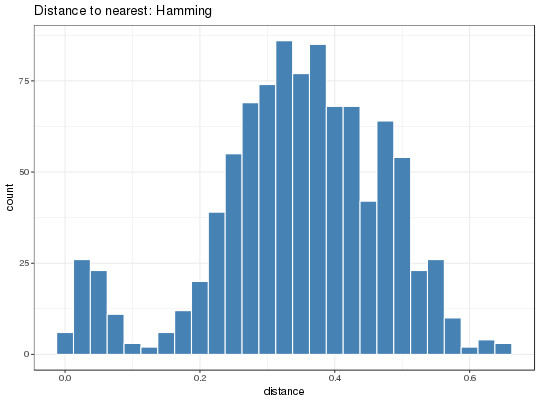

**distToNearest** - *Distance to nearest neighbor*

Description
--------------------

Get non-zero distance of every sequence (as defined by `sequenceColumn`) to its 
nearest sequence sharing same V gene, J gene, and sequence length.


Usage
--------------------
```
distToNearest(db, sequenceColumn = "JUNCTION", vCallColumn = "V_CALL",
jCallColumn = "J_CALL", model = c("ham", "aa", "hh_s1f", "hh_s5f",
"mk_rs1nf", "mk_rs5nf", "m1n_compat", "hs1f_compat"),
normalize = c("length", "none"), symmetry = c("avg", "min"),
first = TRUE, nproc = 1, fields = NULL, cross = NULL, mst = FALSE)
```

Arguments
-------------------

db
:   data.frame containing sequence data.

sequenceColumn
:   name of the column containing nucleotide sequences to compare. 
Also used to determine sequence length for grouping.

vCallColumn
:   name of the column containing the V-segment allele calls.

jCallColumn
:   name of the column containing the J-segment allele calls.

model
:   underlying SHM model, which must be one of 
`c("ham", "aa", "hh_s1f", "hh_s5f", "mk_rs1nf", "hs1f_compat", "m1n_compat")`.
See Details for further information.

normalize
:   method of normalization. The default is `"length"`, which 
divides the distance by the length of the sequence group. If 
`"none"` then no normalization if performed.

symmetry
:   if model is hs5f, distance between seq1 and seq2 is either the
average (avg) of seq1->seq2 and seq2->seq1 or the minimum (min).

first
:   if `TRUE` only the first call of the gene assignments 
is used. if `FALSE` the union of ambiguous gene 
assignments is used to group all sequences with any 
overlapping gene calls.

nproc
:   number of cores to distribute the function over.

fields
:   additional fields to use for grouping.

cross
:   columns for grouping to calculate distances across groups 
(self vs others).

mst
:   if `TRUE`, return comma-separated branch lengths from minimum 
spanning tree.


Value
-------------------

Returns a modified `db` data.frame with nearest neighbor distances in the 
`DIST_NEAREST` column if `crossGrups=NULL` or in the 
`CROSS_DIST_NEAREST` column if `crossGroups` was specified.


Details
-------------------

The distance to nearest neighbor can be used to estimate a threshold for assigning Ig
sequences to clonal groups. A histogram of the resulting vector is often bimodal, 
with the ideal threshold being a value that separates the two modes.

The following distance measures are accepted by the `model` parameter.


+  `"ham"`:          Single nucleotide Hamming distance matrix from [getDNAMatrix](http://www.inside-r.org/packages/cran/alakazam/docs/getDNAMatrix) 
with gaps assigned zero distance.
+  `"aa"`:           Single amino acid Hamming distance matrix from [getAAMatrix](http://www.inside-r.org/packages/cran/alakazam/docs/getAAMatrix).
+  `"hh_s1f"`:       Human single nucleotide distance matrix derived from [HH_S1F](HH_S1F.md) with 
[calcTargetingDistance](calcTargetingDistance.md).
+  `"hh_s5f"`:       Human 5-mer nucleotide context distance matix derived from [HH_S5F](HH_S5F.md) with 
[calcTargetingDistance](calcTargetingDistance.md).
+  `"mk_rs1nf"`:     Mouse single nucleotide distance matrix derived from [MK_RS1NF](MK_RS1NF.md) with 
[calcTargetingDistance](calcTargetingDistance.md).
+  `"mk_rs5nf"`:     Mouse 5-mer nucleotide context distance matrix derived from [MK_RS1NF](MK_RS1NF.md) with 
[calcTargetingDistance](calcTargetingDistance.md).
+  `"hs1f_compat"`:  Backwards compatible human single nucleotide distance matrix used in 
SHazaM v0.1.4 and Change-O v0.3.3.
+  `"m1n_compat"`:   Backwards compatibley mouse single nucleotide distance matrix used in 
SHazaM v0.1.4 and Change-O v0.3.3.


Note on `NA`s: if, for a given combination of V gene, J gene, and sequence length,
there is only 1 sequence (as defined by `sequenceColumn`), `NA` is returned 
instead of a distance (since it has no neighbor). If for a given combination there are 
multiple sequences but only 1 unique sequence, (in which case every sequence in this 
group is the de facto nearest neighbor to each other, thus giving rise to distances 
of 0), `NA`s are returned instead of zero-distances.


References
-------------------


1. Smith DS, et al. Di- and trinucleotide target preferences of somatic 
mutagenesis in normal and autoreactive B cells. 
J Immunol. 1996 156:2642-52. 
1. Glanville J, Kuo TC, von Budingen H-C, et al. 
Naive antibody gene-segment frequencies are heritable and unaltered by 
chronic lymphocyte ablation. 
Proc Natl Acad Sci USA. 2011 108(50):20066-71.
1. Yaari G, et al. Models of somatic hypermutation targeting and substitution based 
on synonymous mutations from high-throughput immunoglobulin sequencing data. 
Front Immunol. 2013 4:358.
 


Examples
-------------------

```R
# Subset example data to one sample as a demo
data(ExampleDb, package="alakazam")
db <- subset(ExampleDb, SAMPLE == "-1h")

# Use genotyped V assignments, Hamming distance, and normalize by junction length
dist <- distToNearest(db, vCallColumn="V_CALL_GENOTYPED", model="ham", 
first=FALSE, normalize="length")

# Plot histogram of non-NA distances
p1 <- ggplot(data=subset(dist, !is.na(DIST_NEAREST))) + 
theme_bw() + 
ggtitle("Distance to nearest: Hamming") + 
xlab("distance") +
geom_histogram(aes(x=DIST_NEAREST), binwidth=0.025, 
fill="steelblue", color="white")
plot(p1)

```



```R

# Use human 5-mer model
dist <- distToNearest(db, vCallColumn="V_CALL_GENOTYPED", model="hh_s5f")
```


See also
-------------------

See [calcTargetingDistance](calcTargetingDistance.md) for generating nucleotide distance matrices 
from a [TargetingModel](TargetingModel-class.md) object. See [HH_S5F](HH_S5F.md), [HH_S1F](HH_S1F.md), 
[MK_RS1NF](MK_RS1NF.md), [getDNAMatrix](http://www.inside-r.org/packages/cran/alakazam/docs/getDNAMatrix), and [getAAMatrix](http://www.inside-r.org/packages/cran/alakazam/docs/getAAMatrix)
for individual model details.


