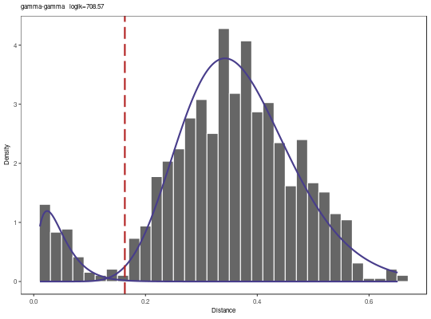
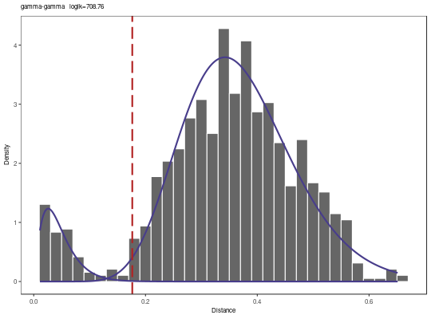
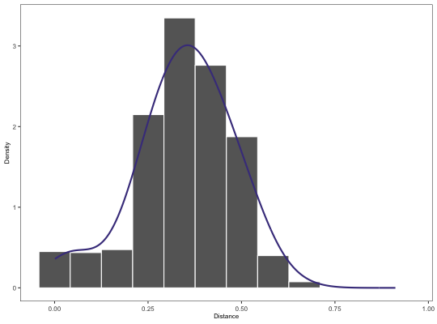

**findThreshold** - *Find distance threshold*

Description
--------------------

`findThreshold` automtically determines an optimal threshold for clonal assignment of
Ig sequences using a vector of nearest neighbor distances. It provides two alternative methods 
using either a Gamma/Guassian Mixture Model fit (`method="gmm"`) or kernel density 
fit (`method="density"`).


Usage
--------------------
```
findThreshold(distances, method = c("density", "gmm"), edge = 0.9,
cross = NULL, subsample = NULL, model = c("gamma-gamma",
"gamma-norm", "norm-gamma", "norm-norm"), cutoff = c("optimal",
"intersect", "user"), sen = NULL, spc = NULL, progress = FALSE)
```

Arguments
-------------------

distances
:   numeric vector containing nearest neighbor distances.

method
:   string defining the method to use for determining the optimal threshold.
One of `"gmm"` or `"density"`. See Details for methodological
descriptions.

edge
:   upper range as a fraction of the data density to rule initialization of 
Gaussian fit parameters. Default value is 90
Applies only when `method="density"`. .

cross
:   supplementary nearest neighbor distance vector output from [distToNearest](distToNearest.md) 
for initialization of the Gaussian fit parameters. 
Applies only when `method="gmm"`.

subsample
:   maximum number of distances to subsample to before threshold detection.

model
:   allows the user to choose among four possible combinations of fitting curves: 
`"norm-norm"`, `"norm-gamma"`, `"gamma-norm"`, 
and `"gamma-gamma"`. Applies only when `method="gmm"`.

cutoff
:   method to use for threshold selection: the optimal threshold `"opt"`, 
the intersection point of the two fitted curves `"intersect"`, or 
a value defined by user for one of the sensitivity or specificity `"user"`.
Applies only when `method="gmm"`.

sen
:   sensitivity required. Applies only when `method="gmm"` and `cutoff="user"`.

spc
:   specificity required. Applies only when `method="gmm"` and `cutoff="user"`.

progress
:   if `TRUE` print a progress bar.


Value
-------------------


+  `"gmm"` method:      Returns a [GmmThreshold](GmmThreshold-class.md) object including the  
`threshold` and the function fit parameters, i.e.
mixing weight, mean, and standard deviation of a Normal distribution, or 
mixing weight, shape and scale of a Gamma distribution.
+  `"density"` method:  Returns a [DensityThreshold](DensityThreshold-class.md) object including the optimum 
`threshold` and the density fit parameters.


Details
-------------------


+  `"gmm"`:     Performs a maximum-likelihood fitting procedure, for learning 
the parameters of two mixture univariate, either Gamma or Gaussian, distributions 
which fit the bimodal distribution entries. Retrieving the fit parameters, 
it then calculates the optimum threshold `method="optimal"`, where the 
average of the sensitivity plus specificity reaches its maximum. In addition, 
the `findThreshold` function is also able 
to calculate the intersection point (`method="intersect"`) of the two fitted curves 
and allows the user to invoke its value as the cut-off point, instead of optimal point.
+  `"density"`: Fits a binned approximation to the ordinary kernel density estimate
to the nearest neighbor distances after determining the optimal
bandwidth for the density estimate via least-squares cross-validation of 
the 4th derivative of the kernel density estimator. The optimal threshold
is set as the minimum value in the valley in the density estimate
between the two modes of the distribution.


Note
-------------------

Visually inspecting the resulting distribution fits is strongly recommended when using 
either fitting method. Empirical observations imply that the bimodality 
of the distance-to-nearest distribution is detectable for a minimum of 1,000 distances.
Larger numbers of distances will improve the fitting procedure, although this can come 
at the expense of higher computational demands.


Examples
-------------------

```R
# Subset example data to one sample as a demo
data(ExampleDb, package="alakazam")
db <- subset(ExampleDb, SAMPLE == "-1h")

# Use nucleotide Hamming distance and normalize by junction length
db <- distToNearest(db, model="ham", normalize="len", nproc=1)

# Find threshold using the "gmm" method with optimal threshold
output <- findThreshold(db$DIST_NEAREST, method="gmm", model="gamma-gamma", cutoff="opt")
plot(output, binwidth=0.02, title=paste0(output@model, "   loglk=", output@loglk))

```



```R
print(output)

```


```
[1] 0.1568455

```


```R

# Find threshold using the "gmm" method with user defined specificity
output <- findThreshold(db$DIST_NEAREST, method="gmm", model="gamma-gamma", 
cutoff="user", spc=0.99)
plot(output, binwidth=0.02, title=paste0(output@model, "   loglk=", output@loglk))

```



```R
print(output)

```


```
[1] 0.1741973

```


```R

# Find threshold using the "density" method and plot the results
output <- findThreshold(db$DIST_NEAREST, method="density")
plot(output)

```

*Warning*:Removed 1 rows containing missing values (geom_vline).

```R
print(output)
```


```
[1] NA

```


See also
-------------------

See [distToNearest](distToNearest.md) for generating the nearest neighbor distance vectors.
See [plotGmmThreshold](plotGmmThreshold.md) and [plotDensityThreshold](plotDensityThreshold.md) for plotting output.


