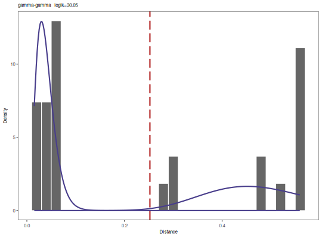

**findThreshold** - *Find distance threshold*

Description
--------------------

`findThreshold` automtically determines an optimal threshold for clonal assignment of
Ig sequences using a vector of nearest neighbor distances. It provides two alternative methods 
using either a Gamma/Guassian Mixture Model fit (`method="gmm"`) or kernel density 
fit (`method="density"`).


Usage
--------------------
```
findThreshold(data, method = c("gmm", "density"), cutEdge = 0.9,
cross = NULL, subsample = NULL, model = c("gamma-gamma", "gamma-norm",
"norm-gamma", "norm-norm"), cutoff = c("opt", "intxn"), progress = FALSE)
```

Arguments
-------------------

data
:   numeric vector containing nearest neighbor distances.

method
:   string defining the method to use for determining the optimal threshold.
One of `"gmm"` or `"density"`. See Details for methodological
descriptions.

cutEdge
:   upper range (a fraction of the data density) to rule initialization of 
Gaussian fit parameters. Default value is equal to 90
Applies only to the `"gmm"` method.

cross
:   supplementary nearest neighbor distance vector output from [distToNearest](distToNearest.md) 
for initialization of the Gaussian fit parameters. 
Applies only to the `"gmm"` method.

subsample
:   number of distances to subsample for speeding up bandwidth inference.
Applies only to the `"density"` method. If `NULL` no subsampling
is performed. As bandwith inferrence is computationally expensive, subsampling
is recommended for large data sets.

model
:   allows the user to choose among four possible combinations of fitting curves: 
(1) `"norm-norm"`, (2) `"norm-gamma"`, (3) `"gamma-norm"`, 
and (4) `"gamma-gamma"`. Applies only to the `"gmm"` method.

cutoff
:   allows the user to choose the type of the threshold, either the intersection point
of the two fitted curves `"intxn"`, or the optimal threshold `"opt"`. 
Applies only to the `"gmm"` method.

progress
:   if `TRUE` print a progress bar.


Value
-------------------


+  `"gmm"` method:      Returns a [GmmThreshold](GmmThreshold-class.md) object including the  
`threshold` and the function fit parameters, i.e.
mixing weight, mean, and standard deviation of a Normal distribution, or 
mixing weight, shape and scale of a Gamma distribution.
+  `"density"` method:  Returns a [DensityThreshold](DensityThreshold-class.md) object including the optimum 
`threshold` and the density fit parameters.


Details
-------------------


+  `"gmm"`:     Performs a maximum-likelihood fitting procedure, for learning 
the parameters of two mixture univariate, either Gamma or Gaussian, distributions 
which fit the bimodal distribution entries. Retrieving the fit parameters, 
it then calculates the optimum threshold `"opt"`, where the average of the sensitivity 
plus specificity reaches its maximum. In addition, findThreshold function is also able 
to calculate the intersection point (`"intxn"`) of the two fitted curves and allows 
the user to invoke its value as the cut-off point, instead of optimum `"opt"` point.
+  `"density"`: Fits a binned approximation to the ordinary kernel density estimate
to the nearest neighbor distances after determining the optimal
bandwidth for the density estimate via least-squares cross-validation of 
the 4th derivative of the kernel density estimator. The optimal threshold
is set as the minimum value in the valley in the density estimate
between the two modes of the distribution.


Examples
-------------------

```R
# Subset example data to one sample as a demo
data(ExampleDb, package="alakazam")
db <- subset(ExampleDb, SAMPLE == "-1h")

# Use nucleotide Hamming distance and normalize by junction length
db <- distToNearest(db, model="ham", normalize="len", nproc=1)

# Find threshold using the "gmm" method
output <- findThreshold(db$DIST_NEAREST, method="gmm", model="norm-norm", cutoff="opt")
print(output)

```


```
[1] 0.1095496

```


```R
# Plot "gmm" method results
plot(output, binwidth=0.02, title=paste0(output@model, "   loglk=", output@loglk))

```



```R

# Find threshold using the "density" method 
output <- findThreshold(db$DIST_NEAREST, method="density")
print(output)

```


```
[1] 0.1226913

```


```R
# Plot "density" method results
plot(output)
```


See also
-------------------

See [distToNearest](distToNearest.md) for generating the nearest neighbor distance vectors.
See [plotGmmThreshold](plotGmmThreshold.md) and [plotDensityThreshold](plotDensityThreshold.md) for plotting output.


