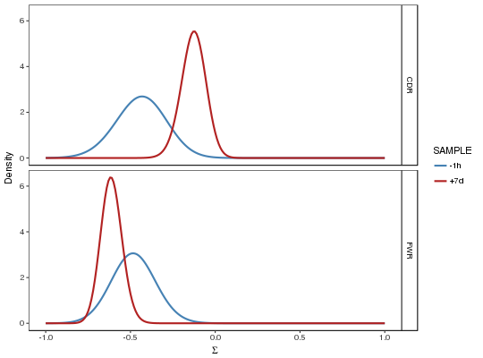
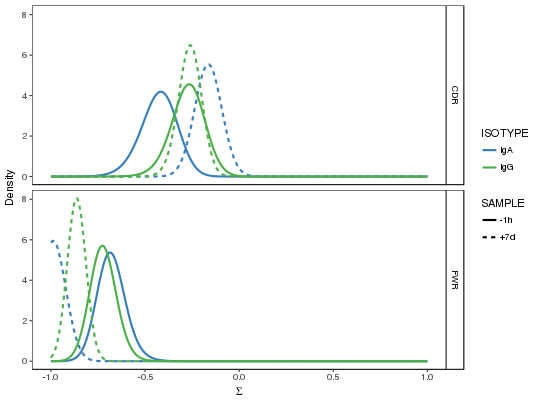
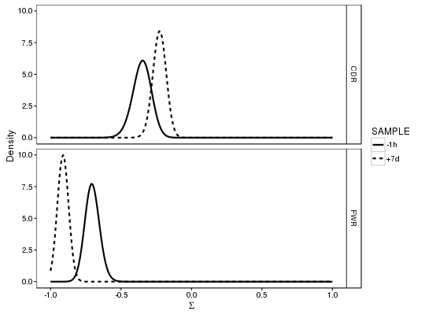

**groupBaseline** - *Group BASELINe PDFs*

Description
--------------------

`groupBaseline` convolves groups of BASELINe posterior probability density 
functions (PDFs) to get combined PDFs for each group.


Usage
--------------------
```
groupBaseline(baseline, groupBy, nproc = 1)
```

Arguments
-------------------

baseline
:   `Baseline` object containing the `db` and the 
BASELINe posterior probability density functions 
(PDF) for each of the sequences, as returned by
[calcBaseline](calcBaseline.md).

groupBy
:   The columns in the `db` slot of the `Baseline`
object by which to group the sequence PDFs.

nproc
:   number of cores to distribute the operation over. If 
`nproc` = 0 then the `cluster` has already been
set and will not be reset.


Value
-------------------

A `Baseline` object, containing the modified `db` and the BASELINe 
posterior probability density functions (PDF) for each of the groups.


Details
-------------------

While the selection strengths predicted by BASELINe perform well on average, 
the estimates for individual sequences can be highly variable, especially when the 
number of mutations is small. 

To overcome this, PDFs from sequences grouped by biological or experimental relevance,
are convolved to from a single PDF for the selection strength. For example, sequences
from each sample may be combined together, allowing you to compare selection  across 
samples. This is accomplished through a fast numerical convolution technique.


References
-------------------


1. Yaari G, et al. Quantifying selection in high-throughput immunoglobulin 
sequencing data sets. 
Nucleic Acids Res. 2012 40(17):e134. 
(Corrections at http://selection.med.yale.edu/baseline/correction/)
 


Examples
-------------------

```R
# Subset example data from alakazam
data(ExampleDb, package="alakazam")
db <- subset(ExampleDb, ISOTYPE %in% c("IgM", "IgG"))

# Collapse clones
db <- collapseClones(db, sequenceColumn="SEQUENCE_IMGT",
germlineColumn="GERMLINE_IMGT_D_MASK",
method="thresholdedFreq", minimumFrequency=0.6,
includeAmbiguous=FALSE, breakTiesStochastic=FALSE)

# Calculate BASELINe
baseline <- calcBaseline(db, 
sequenceColumn="SEQUENCE_IMGT",
germlineColumn="GERMLINE_IMGT_D_MASK", 
testStatistic="focused",
regionDefinition=IMGT_V,
targetingModel=HH_S5F,
nproc=1)

```


```
Calculating the expected frequencies of mutations...
Calculating BASELINe probability density functions...

```


```R

# Group PDFs by sample
grouped1 <- groupBaseline(baseline, groupBy="SAMPLE")

```


```
Grouping BASELINe probability density functions...
Calculating BASELINe statistics...

```


```R
sample_colors <- c("-1h"="steelblue", "+7d"="firebrick")
plotBaselineDensity(grouped1, idColumn="SAMPLE", colorValues=sample_colors, 
sigmaLimits=c(-1, 1))

```



```R
 
# Group PDFs by both sample (between variable) and isotype (within variable)
grouped2 <- groupBaseline(baseline, groupBy=c("SAMPLE", "ISOTYPE"))

```


```
Grouping BASELINe probability density functions...
Calculating BASELINe statistics...

```


```R
isotype_colors <- c("IgM"="darkorchid", "IgD"="firebrick", 
"IgG"="seagreen", "IgA"="steelblue")
plotBaselineDensity(grouped2, idColumn="SAMPLE", groupColumn="ISOTYPE",
colorElement="group", colorValues=isotype_colors,
sigmaLimits=c(-1, 1))

```



```R

# Collapse previous isotype (within variable) grouped PDFs into sample PDFs
grouped3 <- groupBaseline(grouped2, groupBy="SAMPLE")

```


```
Grouping BASELINe probability density functions...
Calculating BASELINe statistics...

```


```R
sample_colors <- c("-1h"="steelblue", "+7d"="firebrick")
plotBaselineDensity(grouped3, idColumn="SAMPLE", colorValues=sample_colors,
sigmaLimits=c(-1, 1))
```




See also
-------------------

To generate the baseline object see [calcBaseline](calcBaseline.md).
To calculate BASELINe statistics, such as the mean selection strength
and the 95% confidence interval, see [summarizeBaseline](summarizeBaseline.md).


