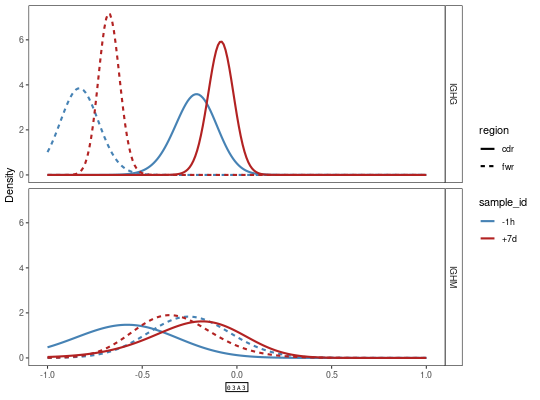

**plotBaselineDensity** - *Plots BASELINe probability density functions*

Description
--------------------

`plotBaselineDensity` plots the probability density functions resulting from selection 
analysis using the BASELINe method.


Usage
--------------------
```
plotBaselineDensity(baseline, idColumn, groupColumn = NULL,
colorElement = c("id", "group"), colorValues = NULL, title = NULL,
subsetRegions = NULL, sigmaLimits = c(-5, 5), facetBy = c("region",
"group"), style = c("density"), sizeElement = c("none", "id",
"group"), size = 1, silent = FALSE, ...)
```

Arguments
-------------------

baseline
:   `Baseline` object containing selection probability 
density functions.

idColumn
:   name of the column in the `db` slot of `baseline` 
containing primary identifiers.

groupColumn
:   name of the column in the `db` slot of `baseline` 
containing secondary grouping identifiers. If `NULL`, 
organize the plot only on values in `idColumn`.

colorElement
:   one of `c("id", "group")` specifying whether the 
`idColumn` or `groupColumn` will be used for color coding. 
The other entry, if present, will be coded by line style.

colorValues
:   named vector of colors for entries in `colorElement`, with 
names defining unique values in the `colorElement` column and values
being colors. Also controls the order in which values appear on the
plot. If `NULL` alphabetical ordering and a default color palette 
will be used.

title
:   string defining the plot title.

subsetRegions
:   character vector defining a subset of regions to plot, correspoding 
to the regions for which the `baseline` data was calculated. If
`NULL` all regions in `baseline` are plotted.

sigmaLimits
:   numeric vector containing two values defining the `c(lower, upper)`
bounds of the selection scores to plot.

facetBy
:   one of `c("region", "group")` specifying which category to facet the
plot by, either values in `groupColumn` ("group") or regions
defined in the `regions` slot of the `baseline` object ("region").
If this is set to "group", then the region will behave as the `groupColumn`
for purposes of the `colorElement` argument.

style
:   type of plot to draw. One of:

+  `"density"`:  plots a set of curves for each probability 
density function in `baseline`, 
with colors determined by values in the
`colorElement` column.
Faceting is determined by the 
`facetBy` argument.


sizeElement
:   one of `c("none", "id", "group")` specifying whether the lines in the
plot should be all of the same size (`none`) or have their sizes depend on 
the values in `id` or `code`.

size
:   numeric scaling factor for lines, points and text in the plot.

silent
:   if `TRUE` do not draw the plot and just return the ggplot2 
object; if `FALSE` draw the plot.

...
:   additional arguments to pass to ggplot2::theme.


Value
-------------------

A ggplot object defining the plot.


Examples
-------------------

```R
# Subset example data
data(ExampleDb, package="alakazam")
db <- subset(ExampleDb, ISOTYPE %in% c("IgM", "IgG"))

# Collapse clones
db <- collapseClones(db, sequenceColumn="SEQUENCE_IMGT",
germlineColumn="GERMLINE_IMGT_D_MASK",
method="thresholdedFreq", minimumFrequency=0.6,
includeAmbiguous=FALSE, breakTiesStochastic=FALSE)

# Calculate BASELINe
baseline <- calcBaseline(db, 
sequenceColumn="SEQUENCE_IMGT",
germlineColumn="GERMLINE_IMGT_D_MASK", 
testStatistic="focused",
regionDefinition=IMGT_V,
targetingModel=HH_S5F,
nproc=1)

```


```
Calculating the expected frequencies of mutations...
Calculating BASELINe probability density functions...

```


```R
 
# Grouping the PDFs by the sample and isotype annotations
grouped <- groupBaseline(baseline, groupBy=c("SAMPLE", "ISOTYPE"))

```


```
Grouping BASELINe probability density functions...
Calculating BASELINe statistics...

```


```R

# Plot density faceted by region with custom isotype colors
isotype_colors <- c("IgM"="darkorchid", "IgD"="firebrick", 
"IgG"="seagreen", "IgA"="steelblue")
plotBaselineDensity(grouped, "SAMPLE", "ISOTYPE", colorValues=isotype_colors, 
colorElement="group", sigmaLimits=c(-1, 1))

```


```R

# Facet by isotype instead of region
sample_colors <- c("-1h"="steelblue", "+7d"="firebrick")
plotBaselineDensity(grouped, "SAMPLE", "ISOTYPE", facetBy="group",
colorValues=sample_colors, sigmaLimits=c(-1, 1))
```




See also
-------------------

Takes as input a [Baseline](Baseline-class.md) object returned from [groupBaseline](groupBaseline.md).


