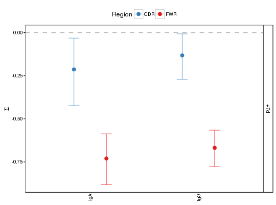
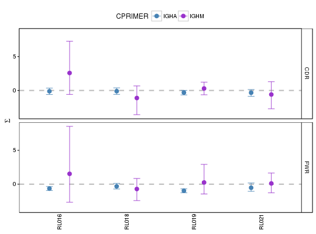
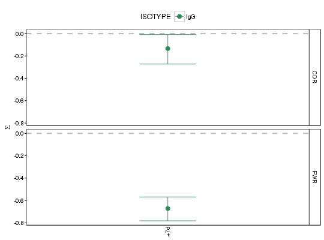

**plotBaselineSummary** - *Plots BASELINe summary statistics*

Description
--------------------

`plotBaselineSummary` plots a summary of the results of selection analysis 
using the BASELINe method.

Usage
--------------------

```
plotBaselineSummary(baseline, idColumn, groupColumn = NULL,
groupColors = NULL, subsetRegions = NULL, facetBy = c("region",
"group"), title = NULL, style = c("mean"), size = 1, silent = FALSE,
...)
```

Arguments
-------------------

baseline
:   either a data.frame returned from [summarizeBaseline](summarizeBaseline.md)
or a `Baseline` object returned from [groupBaseline](groupBaseline.md)
containing selection probability density functions and summary 
statistics.

idColumn
:   name of the column in `baseline` containing primary identifiers. 
If the input is a `Baseline` object, then this will be a column
in the `stats` slot of `baseline`.

groupColumn
:   name of the column in `baseline` containing secondary grouping 
identifiers. If the input is a `Baseline` object, then this will 
be a column in the `stats` slot of `baseline`.

groupColors
:   named vector of colors for entries in `groupColumn`, with 
names defining unique values in the `groupColumn` and values
being colors. Also controls the order in which groups appear on the
plot. If `NULL` alphabetical ordering and a default color palette 
will be used. Has no effect if `facetBy="group"`.

subsetRegions
:   character vector defining a subset of regions to plot, correspoding 
to the regions for which the `baseline` data was calculated. If
`NULL` all regions in `baseline` are plotted.

facetBy
:   one of c("group", "region") specifying which category to facet the
plot by, either values in `groupColumn` ("group") or regions
defined in `baseline` ("region"). The data that is not used
for faceting will be color coded.

title
:   string defining the plot title.

style
:   type of plot to draw. One of:

+  `"mean"`:     plots the mean and confidence interval for
the selection scores of each value in 
`idColumn`. Faceting and coloring
are determine by values in `groupColumn`
and regions defined in `baseline`, 
depending upon the `facetBy` argument.


size
:   numeric scaling factor for lines, points and text in the plot.

silent
:   if `TRUE` do not draw the plot and just return the ggplot2 
object; if `FALSE` draw the plot.

...
:   additional arguments to pass to ggplot2::theme.


Value
-------------------

A ggplot object defining the plot.


Examples
-------------------

```R
# Subset example data
db <- subset(InfluenzaDb, CPRIMER %in% c("IGHA","IGHM") & 
BARCODE %in% c("RL016","RL018","RL019","RL021"))

# Calculate BASELINe
# By default, calcBaseline collapses the sequences in the db by the column "CLONE",
# calculates the numbers of observed mutations and expected frequencies of mutations,
# as defined in the IMGT_V_NO_CDR3 and using the HS5FModel targeting model.
# Then, it calculates  the BASELINe posterior probability density functions (PDFs) for
# sequences in the updated db files; using the focused test statistic
db_baseline <- calcBaseline(db, 
sequenceColumn="SEQUENCE_IMGT",
germlineColumn="GERMLINE_IMGT_D_MASK", 
testStatistic="focused",
regionDefinition=IMGT_V_NO_CDR3,
targetingModel = HS5FModel,
nproc = 1)

```


```
Collapsing clonal sequences...
Calculating observed number of mutations...
Calculating the expected frequencies of mutations...
Calculating BASELINe probability density functions...

```


```R
 
# Grouping the PDFs by the BARCODE and CPRIMER columns in the db, corresponding 
# respectively to sample barcodes and the constant region isotype primers.
baseline <- groupBaseline(db_baseline, groupBy=c("BARCODE", "CPRIMER"))

```


```
Grouping BASELINe probability density functions...
Calculating BASELINe statistics...

```


```R

# Plot mean and confidence interval
plotBaselineSummary(baseline, "BARCODE", "CPRIMER", style="mean")

```


```R
plotBaselineSummary(baseline, "BARCODE", "CPRIMER", subsetRegions="CDR", style="mean")

```


```R
plotBaselineSummary(baseline, "BARCODE", "CPRIMER", facetBy="group", style="mean")

```



```R

# Reorder and recolor groups
group_colors <- c("IGHM"="darkorchid", "IGHA"="steelblue")
plotBaselineSummary(baseline, "BARCODE", "CPRIMER", groupColors=group_colors, style="mean")

```



```R

# Plot subset of data
stats <- subset(getBaselineStats(baseline), BARCODE %in% c("RL018", "RL019"))
plotBaselineSummary(stats, "BARCODE", "CPRIMER", groupColors=group_colors, style="mean")
```




See also
-------------------

Takes as input either a [Baseline](Baseline-class.md) object returned by [groupBaseline](groupBaseline.md) 
or a data.frame returned from [summarizeBaseline](summarizeBaseline.md).


