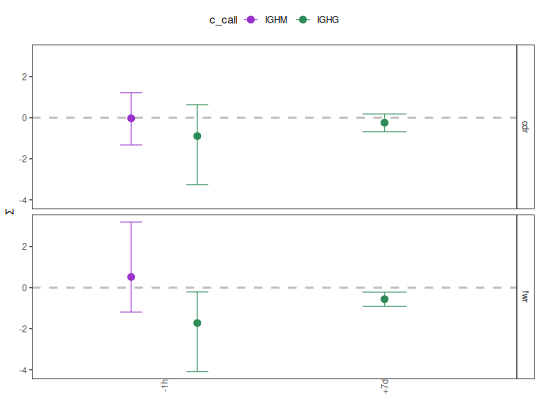

**plotBaselineSummary** - *Plots BASELINe summary statistics*

Description
--------------------

`plotBaselineSummary` plots a summary of the results of selection analysis 
using the BASELINe method.


Usage
--------------------
```
plotBaselineSummary(
baseline,
idColumn,
groupColumn = NULL,
groupColors = NULL,
subsetRegions = NULL,
facetBy = c("region", "group"),
title = NULL,
style = c("summary"),
size = 1,
silent = FALSE,
...
)
```

Arguments
-------------------

baseline
:   either a data.frame returned from [summarizeBaseline](summarizeBaseline.md)
or a `Baseline` object returned from [groupBaseline](groupBaseline.md)
containing selection probability density functions and summary 
statistics.

idColumn
:   name of the column in `baseline` containing primary identifiers. 
If the input is a `Baseline` object, then this will be a column
in the `stats` slot of `baseline`.

groupColumn
:   name of the column in `baseline` containing secondary grouping 
identifiers. If the input is a `Baseline` object, then this will 
be a column in the `stats` slot of `baseline`.

groupColors
:   named vector of colors for entries in `groupColumn`, with 
names defining unique values in the `groupColumn` and values
being colors. Also controls the order in which groups appear on the
plot. If `NULL` alphabetical ordering and a default color palette 
will be used. Has no effect if `facetBy="group"`.

subsetRegions
:   character vector defining a subset of regions to plot, corresponding 
to the regions for which the `baseline` data was calculated. If
`NULL` all regions in `baseline` are plotted.

facetBy
:   one of c("group", "region") specifying which category to facet the
plot by, either values in `groupColumn` ("group") or regions
defined in `baseline` ("region"). The data that is not used
for faceting will be color coded.

title
:   string defining the plot title.

style
:   type of plot to draw. One of:

+  `"summary"`:  plots the mean and confidence interval for
the selection scores of each value in 
`idColumn`. Faceting and coloring
are determine by values in `groupColumn`
and regions defined in `baseline`, 
depending upon the `facetBy` argument.


size
:   numeric scaling factor for lines, points and text in the plot.

silent
:   if `TRUE` do not draw the plot and just return the ggplot2 
object; if `FALSE` draw the plot.

...
:   additional arguments to pass to ggplot2::theme.


Value
-------------------

A ggplot object defining the plot.


Examples
-------------------

```R
# Subset example data as a demo
data(ExampleDb, package="alakazam")
db <- subset(ExampleDb, c_call %in% c("IGHM", "IGHG"))
set.seed(112)
db <- dplyr::slice_sample(db, n=25)

# Collapse clones
db <- collapseClones(db, cloneColumn="clone_id",
sequenceColumn="sequence_alignment",
germlineColumn="germline_alignment_d_mask",
method="thresholdedFreq", minimumFrequency=0.6,
includeAmbiguous=FALSE, breakTiesStochastic=FALSE)

# Calculate BASELINe
baseline <- calcBaseline(db, 
sequenceColumn="clonal_sequence",
germlineColumn="clonal_germline", 
testStatistic="focused",
regionDefinition=IMGT_V,
targetingModel=HH_S5F,
nproc=1)

```

*calcBaseline will calculate observed and expected mutations for clonal_sequence using clonal_germline as a reference.*
```
Calculating BASELINe probability density functions...

```


```R
 
# Grouping the PDFs by sample and isotype annotations
grouped <- groupBaseline(baseline, groupBy=c("sample_id", "c_call"))

```


```
Grouping BASELINe probability density functions...
Calculating BASELINe statistics...

```


```R

# Plot mean and confidence interval by region with custom group colors
isotype_colors <- c("IGHM"="darkorchid", "IGHD"="firebrick", 
"IGHG"="seagreen", "IGHA"="steelblue")
plotBaselineSummary(grouped, "sample_id", "c_call", 
groupColors=isotype_colors, facetBy="region")
```




See also
-------------------

Takes as input either a [Baseline](Baseline-class.md) object returned by [groupBaseline](groupBaseline.md) 
or a data.frame returned from [summarizeBaseline](summarizeBaseline.md).


