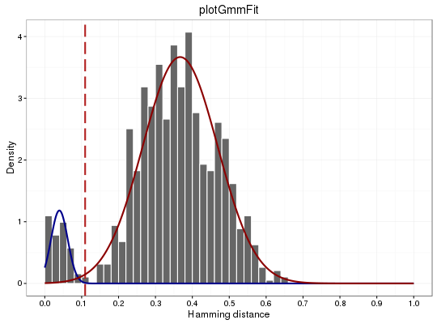

**plotGmmFit** - *Plot findThreshold results for the gmm method*

Description
--------------------

`plotGmmFit`invokes the results of [distToNearest](distToNearest.md) (histogram of distance 
of every sequence to its nearest sequence) and [findThreshold](findThreshold.md), 
(`"gmm"` method; Gaussian fit parameters plus the distance threshold cut) 
functions and combines them in single plot.


Usage
--------------------
```
plotGmmFit(ent, cross = NULL, gaussData = NULL, xmin, xmax, xseq,
histBinwidth, title = NULL, size = 1, threshCut = TRUE, gauss = TRUE,
silent = FALSE, ...)
```

Arguments
-------------------

ent
:   numeric vector of distances returned from [distToNearest](distToNearest.md) function.

cross
:   if not `NULL`, plot histogram of numeric vector `cross` invoked from 
[distToNearest](distToNearest.md) function in <code class = 'eq'>-y</code> direction.

gaussData
:   output object from [findThreshold](findThreshold.md) function including optimum "`threshold`" 
cut and the Gaussian fit parameters, such as mixing proportion ("`omega1`" 
and "`omega2`"), mean ("`mu1`" and "`mu2`"), and standard deviation 
("`sigma1`" and "`sigma2`").

mixing proportion (<code class = 'eq'>\omega</code>), mean (<code class = 'eq'>\mu</code>), and standard deviation (<code class = 'eq'>\sigma</code>).

xmin
:   x-axis minimum range.

xmax
:   x-axis maximum range.

xseq
:   x-axis breaking sequence.

histBinwidth
:   histogram bin size.

title
:   string defining the plot title.

size
:   numeric value for lines in the plot.

threshCut
:   if `TRUE` plot a vertical line passing through threshold; if `FALSE` do not draw.

gauss
:   if `TRUE` plot Gaussian fit curves; if `FALSE` do not draw.

silent
:   if `TRUE` do not draw the plot and just return the ggplot2 
object; if `FALSE` draw the plot.

...
:   additional arguments to pass to ggplot2::theme.


Value
-------------------

A ggplot object defining the plot.


Examples
-------------------

```R
# Subset example data to one sample as a demo
data(ExampleDb, package="alakazam")
db <- subset(ExampleDb, SAMPLE == "-1h")

# Use nucleotide Hamming distance and normalize by junction length
db <- distToNearest(db, model="ham", first=FALSE, normalize="length", nproc=1)

# To find the threshold cut, call findThreshold function for "gmm" method.
output <- findThreshold(db$DIST_NEAREST, method="gmm", cutEdge=0.9)

```


```
[1] "The number of non-NA entries= 958"
[1] "The 'gmm' would be done in 51 iterations"
##################################################

```


```R
print(output)

```


```
An object of class "GmmResults"
Slot "omega1":
[1] 0.06707172

Slot "omega2":
[1] 0.9329283

Slot "mu1":
[1] 0.0395719

Slot "mu2":
[1] 0.3669703

Slot "sigma1":
[1] 0.02262901

Slot "sigma2":
[1] 0.1014838

Slot "threshold":
[1] 0.1094083


```


```R

plotGmmFit(ent=db$DIST_NEAREST, gaussData=output, xmin=0.0, xmax=1, xseq=0.1,
histBinwidth=0.02, title="plotGmmFit")
```




