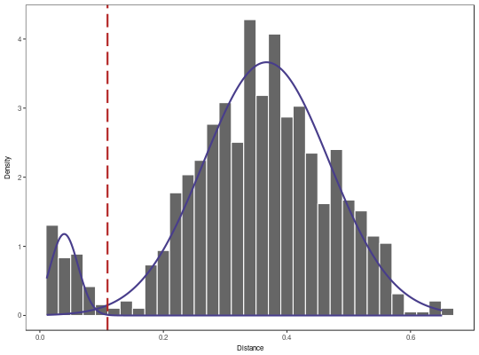

**plotGmmThreshold** - *Plot findThreshold results for the gmm method*

Description
--------------------

`plotGmmThreshold` plots the results from `"gmm"` method of 
[findThreshold](findThreshold.md), including the Guassian distributions, input nearest neighbor 
distance histogram, and threshold selected.


Usage
--------------------
```
plotGmmThreshold(data, cross = NULL, xmin = NULL, xmax = NULL,
breaks = NULL, binwidth = NULL, title = NULL, size = 1,
silent = FALSE, ...)
```

Arguments
-------------------

data
:   [GmmThreshold](GmmThreshold-class.md) object output by the `"gmm"` method 
of [findThreshold](findThreshold.md).

cross
:   numeric vector of distances from [distToNearest](distToNearest.md) to draw as a
histogram below the `data` histogram for comparison purposes.

xmin
:   minimum limit for plotting the x-axis. If `NULL` the limit will 
be set automatically.

xmax
:   maximum limit for plotting the x-axis. If `NULL` the limit will 
be set automatically.

breaks
:   number of breaks to show on the x-axis. If `NULL` the breaks will 
be set automatically.

binwidth
:   binwidth for the histogram. If `NULL` the binwidth 
will be set automatically.

title
:   string defining the plot title.

size
:   numeric value for lines in the plot.

silent
:   if `TRUE` do not draw the plot and just return the ggplot2 
object; if `FALSE` draw the plot.

...
:   additional arguments to pass to ggplot2::theme.


Value
-------------------

A ggplot object defining the plot.


Examples
-------------------

```R
# Subset example data to one sample as a demo
data(ExampleDb, package="alakazam")
db <- subset(ExampleDb, SAMPLE == "-1h")

# Use nucleotide Hamming distance and normalize by junction length
db <- distToNearest(db, model="ham", normalize="len", nproc=1)

# To find the threshold cut, call findThreshold function for "gmm" method.
output <- findThreshold(db$DIST_NEAREST, method="gmm", model="norm-norm", cutoff="opt")
print(output)

```


```
[1] 0.1095496

```


```R

# Plot results
plotGmmThreshold(output, binwidth=0.02)
```




See also
-------------------

See [GmmThreshold](GmmThreshold-class.md) for the the input object definition and 
[findThreshold](findThreshold.md) for generating the input object. See 
[distToNearest](distToNearest.md) calculating nearest neighbor distances.


