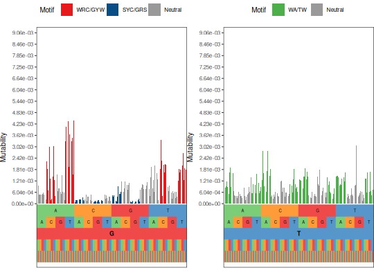

**plotMutability** - *Plot mutability probabilities*

Description
--------------------

`plotMutability` plots the mutability rates of a `TargetingModel`.


Usage
--------------------
```
plotMutability(model, nucleotides = c("A", "C", "G", "T"), mark = NULL,
style = c("hedgehog", "bar"), size = 1, silent = FALSE, ...)
```

Arguments
-------------------

model
:   [TargetingModel](TargetingModel-class.md) object or vector containing normalized 
mutability rates.

nucleotides
:   vector of center nucleotide characters to plot.

mark
:   vector of 5-mer motifs to highlight in the plot. If `NULL`
only highlight classical hot and cold spot motifs.

style
:   type of plot to draw. One of:

+  `"hedgehog"`:  circular plot showing higher mutability
scores further from the circle. The 5-mer
is denoted by the values of the inner 
circle. The 5-mer is read from the most interior 
position of the 5-mer (5') to most exterior position 
(3'), with the center nucleotide in the center ring.
Note, the order in which the 5-mers are plotted is
different for nucleotides `c("A", "C")` and 
`c("G", "T")`.
+  `"bar"`:       bar plot of mutability similar to the 
`hedgehog` style with the most 5' positions
of each 5-mer at the base of the plot.


size
:   numeric scaling factor for lines and text in the plot.

silent
:   if `TRUE` do not draw the plot and just return the ggplot2 
objects; if `FALSE` draw the plot.

...
:   additional arguments to pass to ggplot2::theme.


Value
-------------------

A named list of ggplot objects defining the plots, with names defined by the 
center nucleotide for the plot object.


Examples
-------------------

```R
# Plot one nucleotide in circular style
plotMutability(HH_S5F, "C")

```


```R

# Plot two nucleotides in barchart style
plotMutability(HH_S5F, c("G", "T"), style="bar")
```




See also
-------------------

Takes as input a [TargetingModel](TargetingModel-class.md) object. 
See [createTargetingModel](createTargetingModel.md) for model building.


