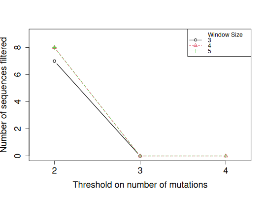
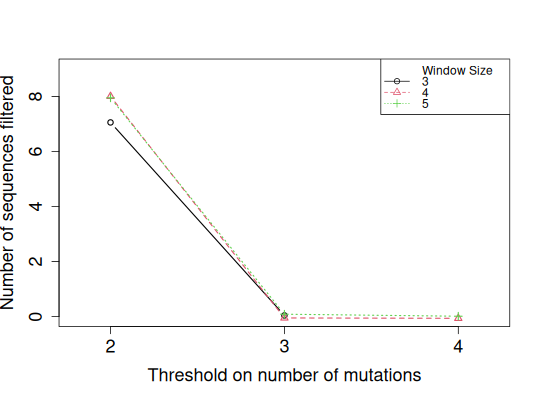
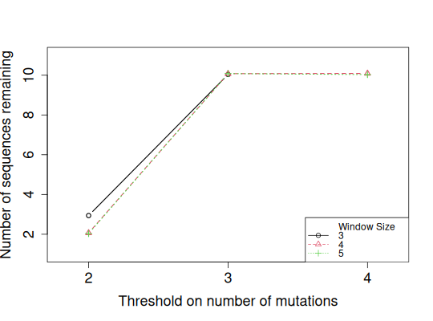
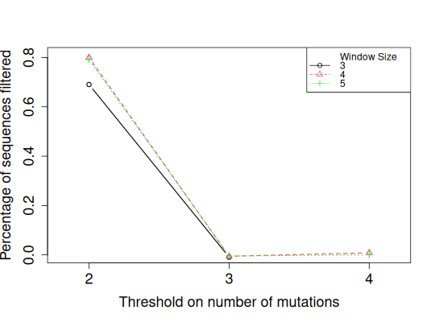

**slideWindowTunePlot** - *slideWindowTunePlot - plotSlideWindowTune backward compatibility*

Description
--------------------

Wrapper function for [plotSlideWindowTune](plotSlideWindowTune.md)


Usage
--------------------
```
slideWindowTunePlot(
tuneList,
plotFiltered = c(TRUE, FALSE, NULL, "filtered", "remaining", "per_mutation"),
percentage = FALSE,
jitter.x = FALSE,
jitter.x.amt = 0.1,
jitter.y = FALSE,
jitter.y.amt = 0.1,
pchs = 1,
ltys = 2,
cols = 1,
plotLegend = TRUE,
legendPos = "topright",
legendHoriz = FALSE,
legendCex = 1,
title = NULL,
returnRaw = FALSE
)
```

Arguments
-------------------

tuneList
:   a list of logical matrices returned by [slideWindowTune](slideWindowTune.md).

plotFiltered
:   whether to plot the number of filtered (`TRUE` or `filtered`), 
or remaining (FALSE or remaining) sequences for each mutation threshold. 
Use `NULL` or `per_mutation` to plot the number of sequences 
at each mutation value. Default is `TRUE`.

percentage
:   whether to plot on the y-axis the percentage of filtered sequences
(as opposed to the absolute number). Default is `FALSE`.

jitter.x
:   whether to jitter x-axis values. Default is `FALSE`.

jitter.x.amt
:   amount of jittering to be applied on x-axis values if 
`jitter.x=TRUE`. Default is 0.1.

jitter.y
:   whether to jitter y-axis values. Default is `FALSE`.

jitter.y.amt
:   amount of jittering to be applied on y-axis values if 
`jitter.y=TRUE`. Default is 0.1.

pchs
:   point types to pass on to [plot](http://www.rdocumentation.org/packages/graphics/topics/plot.default).

ltys
:   line types to pass on to [plot](http://www.rdocumentation.org/packages/graphics/topics/plot.default).

cols
:   colors to pass on to [plot](http://www.rdocumentation.org/packages/graphics/topics/plot.default).

plotLegend
:   whether to plot legend. Default is `TRUE`.

legendPos
:   position of legend to pass on to [legend](http://www.rdocumentation.org/packages/graphics/topics/legend). Can be either a
numeric vector specifying x-y coordinates, or one of 
`"topright"`, `"center"`, etc. Default is `"topright"`.

legendHoriz
:   whether to make legend horizontal. Default is `FALSE`.

legendCex
:   numeric values by which legend should be magnified relative to 1.

title
:   plot main title. Default is NULL (no title)

returnRaw
:   Return a data.frame with sequence counts (TRUE) or a
plot. Default is `FALSE`.


Details
-------------------

For each `windowSize`, if `plotFiltered=TRUE`, the x-axis 
represents a mutation threshold range, and the y-axis the number of
sequences that have at least that number of mutations. If 
`plotFiltered=TRUE`, the y-axis represents the number of sequences
that have less mutations than the mutation threshold range. For the same
window size, a sequence can be included in the counts for different
mutation thresholds. For example, sequence "CCACCAAAA" with germline
"AAAAAAAAA" has 4 mutations. This sequence has at least 2 mutations 
and at least 3 mutations, in a window of size 4. the sequence will
be included in the sequence count for mutation thresholds 2 and 3.
If `plotFiltered=TRUE`, the sequences are counted only once for
each window size, at their largest mutation threshold. The above 
example sequence would be included in the sequence count for 
mutation threshold 3. 

When plotting, a user-defined `amount` of jittering can be applied on values plotted
on either axis or both axes via adjusting `jitter.x`, `jitter.y`, 
`jitter.x.amt` and `jitter.y.amt`. This may be help with visually distinguishing
lines for different window sizes in case they are very close or identical to each other. 
If plotting percentages (`percentage=TRUE`) and using jittering on the y-axis values 
(`jitter.y=TRUE`), it is strongly recommended that `jitter.y.amt` be set very
small (e.g. 0.01). 

`NA` for a combination of `mutThresh` and `windowSize` where 
`mutThresh` is greater than `windowSize` will not be plotted.


Examples
-------------------

```R
# Use an entry in the example data for input and germline sequence
data(ExampleDb, package="alakazam")

# Try out thresholds of 2-4 mutations in window sizes of 3-5 nucleotides 
# on a subset of ExampleDb
tuneList <- slideWindowTune(db = ExampleDb[1:10, ], 
mutThreshRange = 2:4, windowSizeRange = 3:5,
verbose = FALSE)

```


```

  |                                                                                                                                             
  |                                                                                                                                       |   0%
  |                                                                                                                                             
  |==============                                                                                                                         |  10%
  |                                                                                                                                             
  |===========================                                                                                                            |  20%
  |                                                                                                                                             
  |========================================                                                                                               |  30%
  |                                                                                                                                             
  |======================================================                                                                                 |  40%
  |                                                                                                                                             
  |====================================================================                                                                   |  50%
  |                                                                                                                                             
  |=================================================================================                                                      |  60%
  |                                                                                                                                             
  |==============================================================================================                                         |  70%
  |                                                                                                                                             
  |============================================================================================================                           |  80%
  |                                                                                                                                             
  |==========================================================================================================================             |  90%
  |                                                                                                                                             
  |=======================================================================================================================================| 100%
  |                                                                                                                                             
  |                                                                                                                                       |   0%
  |                                                                                                                                             
  |===============                                                                                                                        |  11%
  |                                                                                                                                             
  |==============================                                                                                                         |  22%
  |                                                                                                                                             
  |=============================================                                                                                          |  33%
  |                                                                                                                                             
  |============================================================                                                                           |  44%
  |                                                                                                                                             
  |===========================================================================                                                            |  56%
  |                                                                                                                                             
  |==========================================================================================                                             |  67%
  |                                                                                                                                             
  |=========================================================================================================                              |  78%
  |                                                                                                                                             
  |========================================================================================================================               |  89%
  |                                                                                                                                             
  |=======================================================================================================================================| 100%
```


```R

# Visualize
# Plot numbers of sequences filtered without jittering y-axis values
slideWindowTunePlot(tuneList, pchs=1:3, ltys=1:3, cols=1:3, 
plotFiltered=TRUE, jitter.y=FALSE)

```

*Warning*:slideWindowTunePlot() is deprecated, please see plotSlideWindowTune() for future use

```R

# Notice that some of the lines overlap
# Jittering could help
slideWindowTunePlot(tuneList, pchs=1:3, ltys=1:3, cols=1:3,
plotFiltered=TRUE, jitter.y=TRUE)

```

*Warning*:slideWindowTunePlot() is deprecated, please see plotSlideWindowTune() for future use

```R

# Plot numbers of sequences remaining instead of filtered
slideWindowTunePlot(tuneList, pchs=1:3, ltys=1:3, cols=1:3, 
plotFiltered=FALSE, jitter.y=TRUE, 
legendPos="bottomright")

```

*Warning*:slideWindowTunePlot() is deprecated, please see plotSlideWindowTune() for future use

```R

# Plot percentages of sequences filtered with a tiny amount of jittering
slideWindowTunePlot(tuneList, pchs=1:3, ltys=1:3, cols=1:3,
plotFiltered=TRUE, percentage=TRUE, 
jitter.y=TRUE, jitter.y.amt=0.01)
```

*Warning*:slideWindowTunePlot() is deprecated, please see plotSlideWindowTune() for future use


See also
-------------------

See [slideWindowTune](slideWindowTune.md) for how to get `tuneList`. See [jitter](http://www.rdocumentation.org/packages/base/topics/jitter) for 
use of `amount` of jittering.


