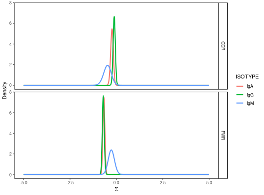

**testBaseline** - *Two-sided test of BASELINe PDFs*

Description
--------------------

`testBaseline` performs a two-sample signifance test of BASELINe 
posterior probability density functions (PDFs).


Usage
--------------------
```
testBaseline(baseline, groupBy)
```

Arguments
-------------------

baseline
:   `Baseline` object containing the `db` and grouped 
BASELINe PDFs returned by [groupBaseline](groupBaseline.md).

groupBy
:   string defining the column in the `db` slot of the 
`Baseline` containing sequence or group identifiers.


Value
-------------------

A data.frame with test results containing the following columns:

+ `REGION`:  sequence region, such as "CDR" and "FWR".
+ `TEST`:    string defining the groups be compared. The
string is formated as the conclusion associated with the
p-value in the form `GROUP1 != GROUP2`. Meaning,
the p-value for rejection of the null hypothesis that 
GROUP1 and GROUP2 have equivalent distributions.
+ `PVALUE`:  two-sided p-value for the comparison.
+ `FDR`:     FDR corrected `PVALUE`.


References
-------------------


1. Yaari G, et al. Quantifying selection in high-throughput immunoglobulin 
sequencing data sets. 
Nucleic Acids Res. 2012 40(17):e134. 
(Corretions at http://selection.med.yale.edu/baseline/correction/)
 


Examples
-------------------

```R
# Subset example data
data(ExampleDb, package="alakazam")
db <- subset(ExampleDb, ISOTYPE %in% c("IgM", "IgG", "IgA"))

# Collapse clones
db <- collapseClones(db, sequenceColumn="SEQUENCE_IMGT",
germlineColumn="GERMLINE_IMGT_D_MASK",
method="thresholdedFreq", minimumFrequency=0.6,
includeAmbiguous=FALSE, breakTiesStochastic=FALSE)

# Calculate BASELINe
baseline <- calcBaseline(db, 
sequenceColumn="CLONAL_SEQUENCE",
germlineColumn="CLONAL_GERMLINE", 
testStatistic="focused",
regionDefinition=IMGT_V,
targetingModel=HH_S5F,
nproc=1)

```


```
Calculating the expected frequencies of mutations...
Calculating BASELINe probability density functions...

```


```R

# Group PDFs by the isotype
grouped <- groupBaseline(baseline, groupBy="ISOTYPE")

```


```
Grouping BASELINe probability density functions...
Calculating BASELINe statistics...

```


```R

# Visualize isotype PDFs
plot(grouped, "ISOTYPE")

```



```R

# Perform test on isotype PDFs
testBaseline(grouped, groupBy="ISOTYPE")
```


```
  REGION       TEST      PVALUE        FDR
1    CDR IgM != IgA 0.126536071 0.15184329
2    CDR IgM != IgG 0.040137450 0.08027490
3    CDR IgA != IgG 0.101394824 0.15184329
4    FWR IgM != IgA 0.010416292 0.03124888
5    FWR IgM != IgG 0.006309629 0.03124888
6    FWR IgA != IgG 0.334456382 0.33445638

```


See also
-------------------

To generate the [Baseline](Baseline-class.md) input object see [groupBaseline](groupBaseline.md).


