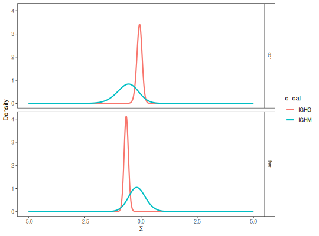

**testBaseline** - *Two-sided test of BASELINe PDFs*

Description
--------------------

`testBaseline` performs a two-sample significance test of BASELINe 
posterior probability density functions (PDFs).


Usage
--------------------
```
testBaseline(baseline, groupBy)
```

Arguments
-------------------

baseline
:   `Baseline` object containing the `db` and grouped 
BASELINe PDFs returned by [groupBaseline](groupBaseline.md).

groupBy
:   string defining the column in the `db` slot of the 
`Baseline` containing sequence or group identifiers.


Value
-------------------

A data.frame with test results containing the following columns:

+ `region`:  sequence region, such as `cdr` and `fwr`.
+ `test`:    string defining the groups be compared. The
string is formatted as the conclusion associated with the
p-value in the form `GROUP1 != GROUP2`. Meaning,
the p-value for rejection of the null hypothesis that 
GROUP1 and GROUP2 have equivalent distributions.
+ `pvalue`:  two-sided p-value for the comparison.
+ `fdr`:     FDR corrected `pvalue`.


References
-------------------


1. Yaari G, et al. Quantifying selection in high-throughput immunoglobulin 
sequencing data sets. 
Nucleic Acids Res. 2012 40(17):e134. 
(Corrections at http://selection.med.yale.edu/baseline/correction/)
 


Examples
-------------------

```R
# Subset example data as a demo
data(ExampleDb, package="alakazam")
db <- subset(ExampleDb, c_call %in% c("IGHM", "IGHG"))
set.seed(112)
db <- dplyr::slice_sample(db, n=200)

# Collapse clones
db <- collapseClones(db, cloneColumn="clone_id",
sequenceColumn="sequence_alignment",
germlineColumn="germline_alignment_d_mask",
method="thresholdedFreq", minimumFrequency=0.6,
includeAmbiguous=FALSE, breakTiesStochastic=FALSE)

# Calculate BASELINe
baseline <- calcBaseline(db, 
sequenceColumn="clonal_sequence",
germlineColumn="clonal_germline", 
testStatistic="focused",
regionDefinition=IMGT_V,
targetingModel=HH_S5F,
nproc=1)

```

*calcBaseline will calculate observed and expected mutations for clonal_sequence using clonal_germline as a reference.*
```
Calculating BASELINe probability density functions...

```


```R

# Group PDFs by the isotype
grouped <- groupBaseline(baseline, groupBy="c_call")

```


```
Grouping BASELINe probability density functions...
Calculating BASELINe statistics...

```


```R

# Visualize isotype PDFs
plot(grouped, "c_call")

```



```R

# Perform test on isotype PDFs
testBaseline(grouped, groupBy="c_call")

```


```
  region         test    pvalue       fdr
1    cdr IGHM != IGHG 0.1353078 0.1353078
2    fwr IGHM != IGHG 0.1112142 0.1353078

```


See also
-------------------

To generate the [Baseline](Baseline-class.md) input object see [groupBaseline](groupBaseline.md).


