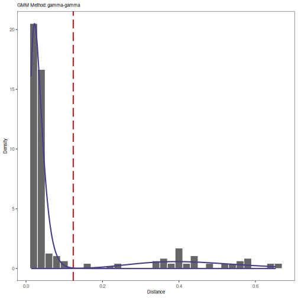
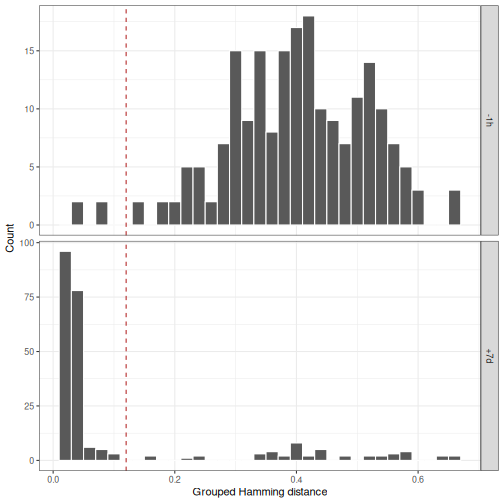

Distance to nearest neighbor
====================


Estimating the optimal distance threshold for partitioning clonally related 
sequences is accomplished by calculating the distance from each sequence in the 
data set to its nearest neighbor and finding the break point in the resulting 
bi-modal distribution that separates clonally related from unrelated sequences. 
This is done via the following steps:

1. Calculating of the nearest neighbor distances for each sequence.
2. Generating a histogram of the nearest neighbor distances followed by either 
   manual inspect for the threshold separating the two modes or
   automated threshold detection.

## Example data

A small example Change-O database is included in the `alakazam` package. 
Calculating the nearest neighbor distances requires the following 
fields (columns) to be present in the Change-O database: 

* `SEQUENCE_ID`
* `V_CALL`
* `J_CALL`
* `JUNCTION`
* `JUNCTION_LENGTH`


```r
# Subset example data to one sample
library(shazam)
data(ExampleDb, package="alakazam")
db <- subset(ExampleDb, SAMPLE == "-1h")
```

## Calculating nearest neighbor distances

The function for calculating distance between every sequence and its nearest
neighbor takes a few parameters to adjust how the distance is measured. If a 
genotype has been inferred using the methods in the `tigger` package, and a 
`V_CALL_GENOTYPED` field has been added to the database, then this column may be 
used instead of the default `V_CALL` column by specifying the `vCallColumn` 
argument. This will allows the more accurate V call from `tigger` to be used for 
grouping of the sequences. Furthermore, for more leniency toward ambiguous 
V(D)J segment calls, the parameter `first` can be set to `FALSE`. Setting 
`first=FALSE` will use the union of all possible genes to group sequences, rather 
than the first gene in the field. The `model` parameter determines which 
underlying SHM model is used to calculate the distance. The default model is 
single nucleotide Hamming distance with gaps considered as a match to any 
nucleotide (`ham`). Other options include a human Ig-specific single nucleotide 
model similar to a transition/transversion model (`hh_s1f`) and the corresponding 
5-mer context model from Yaari et al, 2013 (`hh_s5f`), an analogous pair of 
mouse specific models from Cui et al, 2016 (`mk_rs1nf` and `mk_rs5nf`), and 
amino acid Hamming distance (`aa`). 

**Note:** Human and mouse distance measures that are backward compatible with 
SHazaM v0.1.4 and Change-O v0.3.3 are also provide as `hs1f_compat` and
`m1n_compat`, respectively.

For models that are not symmetric (e.g., distance from A to B is not equal to the
distance from B to A), there is a `symmetry` parameter that allows the user to 
specify whether the average or minimum of the two distances is used to determine 
the overall distance.


```r
# Use nucleotide Hamming distance and normalize by junction length
dist_ham <- distToNearest(db, model="ham", first=FALSE, normalize="len", 
                          nproc=1)

# Use genotyped V assignments, a 5-mer model and no normalization
dist_s5f <- distToNearest(db, vCallColumn="V_CALL_GENOTYPED", model="hh_s5f", 
                          first=FALSE, normalize="none", nproc=1)
```

## Using nearest neighbor distances to determine clonal assignment thresholds

The primary use of the distance to nearest calculation in SHazaM is to 
determine the optimal threshold for clonal assignment using the 
`DefineClones-bygroup` tool in Change-O. Defining a threshold relies on 
distinguishing clonally related sequences (represented by sequences with 
close neighbors) from singletons (sequences without close neighbors), 
which show up as two modes in a nearest neighbor distance histogram. 

Thresholds may be manually determined by inspection of the nearest neighbor histograms
or by using one of the automated threshold detection algorithms provided by the 
`findThreshold` function. The available methods are `density` (smoothed density) and `gmm` 
(Guassian mixture model), and are chosen via the `method` parameter of `findThreshold`.

### Threshold determination by manual inspection

Manual threshold detection simply involves generating a histrogram for the 
values in the `DIST_NEAREST` column of the `distToNearest` output and 
selecting a suitable value within the valley between the two modes.


```r
# Generate Hamming distance histogram
library(ggplot2)
p1 <- ggplot(subset(dist_ham, !is.na(DIST_NEAREST)),
             aes(x=DIST_NEAREST)) + 
    theme_bw() + 
    xlab("Hamming distance") + 
    ylab("Count") +
    scale_x_continuous(breaks=seq(0, 1, 0.1)) +
    geom_histogram(color="white", binwidth=0.02) +
    geom_vline(xintercept=0.12, color="firebrick", linetype=2)
plot(p1)
```


By manual inspection, the length normalized `ham` model distance threshold would be 
set to a value near 0.12 in the above example.


```r
# Generate HH_S5F distance histogram
p2 <- ggplot(subset(dist_s5f, !is.na(DIST_NEAREST)),
             aes(x=DIST_NEAREST)) + 
    theme_bw() + 
    xlab("HH_S5F distance") + 
    ylab("Count") +
    scale_x_continuous(breaks=seq(0, 50, 5)) +
    geom_histogram(color="white", binwidth=1) +
    geom_vline(xintercept=7, color="firebrick", linetype=2)
plot(p2)
```


In this example, the unnormalized `hh_s5f` model distance threshold would be 
set to a value near 7.

### Automated threshold detection via a mixture model

A mixture of two univariate density distribution functions is considered:
\begin{equation}
f(x)= \lambda_1 f_1(x|\phi_1) + \lambda_2 f_2(x|\phi_2).
\end{equation}
Here, the $\lambda_1$ and $\lambda_2$ represent the mixing weights (sum to one), 
$x$ represents the nearest neighbor distance (calculated by function `distToNearest`), 
and $\phi$ represents the vector of each component parameters; mean and standard deviation 
$(\mu, \sigma)$ of a Normal distribution, shape and scale $(k, \theta)$ of a Gamma distribution.

The `"gmm"` (Gamma/Gaussian Mixture Method) is enabled to perform a maximum-likelihood fitting 
procedure over the dist-to-nearest distribution through one of the four combinations of 
$f_1$ and $f_2$: (1) `"norm-norm"`, (2) `"norm-gamma"`, (3) `"gamma-norm"`, and (4) `"gamma-gamma"`. 
A Gaussian mixture model, including expectation maximization algorithm, is also 
implemented into the `findThreshold` function to initialize the fit component parameters 
automatically. The Gaussian mixture model estimates two sets of values; (1) mixing weight $\lambda_i$, 
(2) mean $\mu_i$, and (3) standard deviation $\sigma_i$ where $i\in\{1,2\}$  refers to the first 
and second curve. These parameters are then used as initial values to begin the fitting procedure 
(if Gamma distribution is chosen, the initial values are translated accordingly). 
After maximum-likelihood fitting procedure converges, through an optimization approach, 
it then calculates the optimum threshold where the average of Sensitivity and 
Specificity reaches its maximum.

Below is an example showing how the `"gmm"` method is used to find optimal threshold for 
separating clonally related sequences. The red dashed-line shown in figure below defines the distance 
where the average of the Sensitivity plus Specificity reaches its maximum.


```r
# Find threshold using gmm method
output <- findThreshold(dist_ham$DIST_NEAREST, method="gmm")

# Plot distance histogram, Gaussian fits, and optimum threshold
plot(output, binwidth=0.02, title="GMM Method: gamma-gamma")
```


```r
# Print threshold
print(output)
```

```
## [1] 0.1589916
```

**Note:** The shape of histogram plotted by `plotGmmThreshold` is governed by the `binwidth` parameter.
Meaning, any change in bin size will change the form of the distribution, while the `gmm` method is 
completely bin size independent and only engages the real input data.


### Automated threshold detection via smoothed density

The `density` method will look for the minimum in the valley between two modes of a smoothed 
distribution based on the input vector (`distances`), which will generally be the 
`DIST_NEAREST` column from the `distToNearest` output. Determining the optimal bandwidth 
parameter for smoothing the distribution can be computationally intensive. The bandwidth 
tuning is typically robust when subsampling down to 15,000 distances, though the ideal 
subsampling count will depend upon the data set. The input vector can be subsampled to 
the size specified using the `subsample` parameter.  Below is an example of using the 
`density` method for threshold detection.


```r
# Find threshold using density method
output <- findThreshold(dist_ham$DIST_NEAREST, method="density")
threshold <- output@threshold

# Plot distance histogram, density estimate and optimum threshold
plot(output, title="Density Method")
```


```r
# Print threshold
print(output)
```

```
## [1] 0.1226913
```

## Calculating nearest neighbor distances independently for subsets of data

The `fields` argument to `distToNearest` will split the input `data.frame`
into groups based on values in the specified fields (columns) and will 
treat them independently. For example, if the input data has multiple 
samples, then `fields="SAMPLE"` would allow each sample to be analyzed 
separately.

In the previous examples we used a subset of the original example data. In the
following example, we will use the two available samples, `-1h` and `+7d`, 
and will set `fields="SAMPLE"`. This will reproduce previous results for sample 
`-1h` and add results for sample `+7d`.


```r
dist_fields <- distToNearest(ExampleDb, model="ham", first=FALSE, 
                             normalize="len", fields="SAMPLE", 
                             nproc=1)
```

We can plot the nearest neighbor distances for the two samples:


```r
# Generate grouped histograms
p4 <- ggplot(subset(dist_fields, !is.na(DIST_NEAREST)), 
             aes(x=DIST_NEAREST)) + 
    theme_bw() + 
    xlab("Grouped Hamming distance") + 
    ylab("Count") +
    geom_histogram(color="white", binwidth=0.02) +
    geom_vline(xintercept=0.12, color="firebrick", linetype=2) +
    facet_grid(SAMPLE ~ ., scales="free_y")
plot(p4)
```



In this case, the threshold selected for `-1h` seems to work well 
for `+7d` as well.

## Calculating nearest neighbor distances across groups rather than within a groups

Specifying the `cross` argument to `distToNearest` forces distance calculations 
to be performed across groups, such that the nearest neighbor of each sequence 
will always be a sequence in a different group. In the following example 
we set `cross="SAMPLE"`, which will group the data into `-1h` and 
`+7d` sample subsets. Thus, nearest neighbor distances for sequences in sample 
`-1h` will be restricted to the closest sequence in sample `+7d` and vice versa.


```r
dist_cross <- distToNearest(ExampleDb, model="ham", first=FALSE, 
                            normalize="len", cross="SAMPLE", nproc=1)
```


```r
# Generate cross sample histograms
p5 <- ggplot(subset(dist_cross, !is.na(CROSS_DIST_NEAREST)), 
             aes(x=CROSS_DIST_NEAREST)) + 
    theme_bw() + 
    xlab("Cross-sample Hamming distance") + 
    ylab("Count") +
    geom_histogram(color="white", binwidth=0.02) +
    geom_vline(xintercept=0.12, color="firebrick", linetype=2) +
    facet_grid(SAMPLE ~ ., scales="free_y")
plot(p5)
```



This can provide a sense of overlap between samples or a way to 
compare within-sample variation to cross-sample variation.


