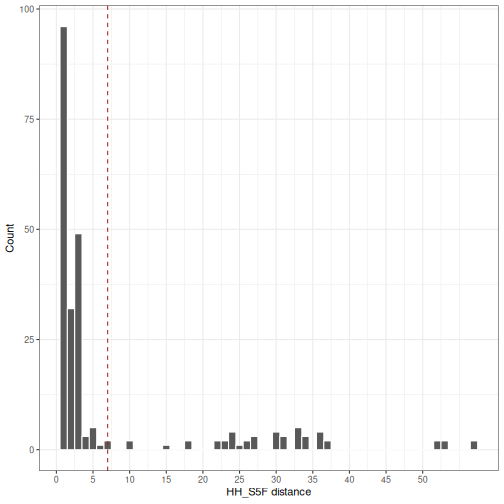
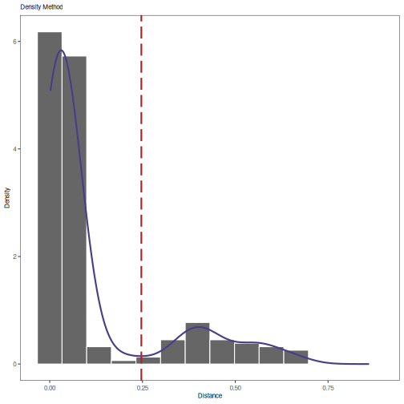

Distance to nearest neighbor
====================


Estimating the optimal distance threshold for partitioning clonally related 
sequences is accomplished by calculating the distance from each sequence in the 
data set to its nearest neighbor and finding the break point in the resulting 
bi-modal distribution that separates clonally related from unrelated sequences. 
This is done via the following steps:

1. Calculate the nearest neighbor distances for each sequence.
2. Generate a histogram of the nearest neighbor distances and inspect for the 
   threshold separating the two modes.

## Example data

A small example Change-O database is included in the `alakazam` package. 
Calculating the nearest neighbor distances requires the following 
fields (columns) to be present in the Change-O database: 

* `SEQUENCE_ID`
* `V_CALL`
* `J_CALL`
* `JUNCTION`
* `JUNCTION_LENGTH`


```r
# Subset example data to one sample
library(shazam)
data(ExampleDb, package="alakazam")
db <- subset(ExampleDb, SAMPLE == "-1h")
```

## Calculating nearest neighbor distances

The function for calculating distance between every sequence and its nearest
neighbor takes a few parameters to adjust how the distance is measured. If a 
genotype has been inferred using the methods in the `tigger` package, and a 
`V_CALL_GENOTYPED` field has been added to the database, then this column may be 
used instead of the default `V_CALL` column by specifying the `vCallColumn` 
argument. This will allows the more accurate V call from `tigger` to be used for 
grouping of the sequences. Furthermore, for more leniency toward ambiguous 
V(D)J segment calls, the parameter `first` can be set to `FALSE`. Setting 
`first=FALSE` will use the union of all possible genes to group sequences, rather 
than the first gene in the field. The `model` parameter determines which 
underlying SHM model is used to calculate the distance. The default model is 
single nucleotide Hamming distance with gaps considered as a match to any 
nucleotide (`ham`). Other options include a human Ig-specific single nucleotide 
model similar to a transition/transversion model (`hh_s1f`) and the corresponding 
5-mer context model from Yaari et al, 2013 (`hh_s5f`), and analogous pair of 
mouse specific models from Cui et al, 2016 (`mk_rs1nf` and `mk_rs5nf`), and 
amino acid Hamming distance (`aa`). 

**Note:** Human mouse distance measure that are backward compatible with 
SHazaM v0.1.4 and Change-O v0.3.3 are also provide as `hs1f_compat` and
`m1n_compat`, respectively.

For models that are not symmetric (e.g., distance from A to B is not equal to the
distance from B to A), there is a `symmetry` parameter that allows the user to 
specify taking the average or the minimum of the two distances to determine the
overall distance.


```r
# Use nucleotide Hamming distance and normalize by junction length
dist_ham <- distToNearest(db, model="ham", first=FALSE, normalize="length", 
                          nproc=1)

# Use genotyped V assignments and 5-mer model
dist_s5f <- distToNearest(db, vCallColumn="V_CALL_GENOTYPED", model="hh_s5f", 
                          first=FALSE, normalize="none", nproc=1)
```

### Generating histograms of nearest neighbor distances

The primary use of the distance to nearest calculation in the Change-O pipeline 
is to determine the optimal threshold for separating clonally related sequences 
(represented by sequences with "near"" neighbors) from singletons (sequences 
without "near"" neighbor), which show up as two modes in a histogram. This can 
be done using the `findThreshold` function, which will look for the minimum 
between two modes of a distribution based on an input vector (`distances`). 
Determining the optimal bandwidth parameter for smoothing the distribution can
be computationally intensive. The bandwidth is typically robust when subsampling 
down to 15,000 distances (possibly even fewer). The input vector can be 
subsampled to the size specified using the `subsample` parameter.


```r
# Find threshold for Hamming nearest neighbor distances
threshold_ham <- findThreshold(dist_ham$DIST_NEAREST)
# Generate Hamming distance histogram
library(ggplot2)
p1 <- ggplot(subset(dist_ham, !is.na(DIST_NEAREST)),
             aes(x=DIST_NEAREST)) + 
    theme_bw() + 
    xlab("Hamming distance") + 
    ylab("Count") +
    scale_x_continuous(breaks=seq(0, 1, 0.1)) +
    geom_histogram(fill="steelblue", color="white", binwidth=0.02) +
    geom_vline(xintercept=threshold_ham, color="firebrick", linetype=3)
plot(p1)
```


In this example, the length normalized `ham` model distance threshold would be 
set to a value near 0.12.


```r
# Find threshold for HH_S5F nearest neighbor distances
threshold_s5f <- findThreshold(dist_s5f$DIST_NEAREST)
# Generate HH_S5F distance histogram
p2 <- ggplot(subset(dist_s5f, !is.na(DIST_NEAREST)),
             aes(x=DIST_NEAREST)) + 
    theme_bw() + 
    xlab("HH_S5F distance") + 
    ylab("Count") +
    scale_x_continuous(breaks=seq(0, 50, 5)) +
    geom_histogram(fill="steelblue", color="white", binwidth=1) +
    geom_vline(xintercept=threshold_s5f, color="firebrick", linetype=3)
plot(p2)
```


In this example, the unnormalized `hh_s5f` model distance threshold would be 
set to a value near 7.

### Calculating nearest neighbor distances independently for subsets of data

The `fields` argument to `distToNearest` will split the input `data.frame`
in groups based on values in the specified fields (columns) and will 
treat them independently. For example, if the input data has multiple 
samples, then `fields="SAMPLE"` would allow each sample to be analyzed 
separately.

In the previous examples we used a subset of the original example data. In the
following example, we will use the two available samples, `-1h` and `+7d`, 
and will set `fields="SAMPLE"`. This will reproduce previous results for sample 
`-1h` and add results for sample `+7d`.


```r
dist_fields <- distToNearest(ExampleDb, model="ham", first=FALSE, 
                             normalize="length", fields="SAMPLE", 
                             nproc=1)
```

We can plot the nearest neighbor distances for the two samples:


```r
# Generate grouped histograms
p3 <- ggplot(subset(dist_fields, !is.na(DIST_NEAREST)), 
             aes(x=DIST_NEAREST)) + 
    theme_bw() + 
    xlab("Grouped Hamming distance") + 
    ylab("Count") +
    geom_histogram(fill="steelblue", color="white", binwidth=0.02) +
    geom_vline(xintercept=threshold_ham, color="firebrick", linetype=3) +
    facet_grid(SAMPLE ~ ., scales="free_y")
plot(p3)
```



In this case, the threshold selected for `-1h` seems to work well 
for `+7d` as well.

### Calculating nearest neighbor distances across groups rather than within a groups

Specifying the `cross` argument to `distToNearest` forces distance calculations 
to be performed across groups, such that the nearest neighbor of each sequence 
will always be a sequence in a different group. In the following example 
we set `cross="SAMPLE"`, which will grouped the data into `-1h` and 
`+7d` sample subsets. Thus, nearest neighbor distances for sequences in sample 
`-1h` will be restricted to the closest sequence in sample `+7d` and vice versa.


```r
dist_cross <- distToNearest(ExampleDb, model="ham", first=FALSE, 
                            normalize="length", cross="SAMPLE", nproc=1)
```


```r
# Generate cross sample histograms
p4 <- ggplot(subset(dist_cross, !is.na(CROSS_DIST_NEAREST)), 
             aes(x=CROSS_DIST_NEAREST)) + 
    theme_bw() + 
    xlab("Cross-sample Hamming distance") + 
    ylab("Count") +
    geom_histogram(fill="steelblue", color="white", binwidth=0.02) +
    geom_vline(xintercept=threshold_ham, color="firebrick", linetype=3) +
    facet_grid(SAMPLE ~ ., scales="free_y")
plot(p4)
```



This can give us a sense of overlap between samples or a way to 
compare within-sample variation to cross-sample variation.
