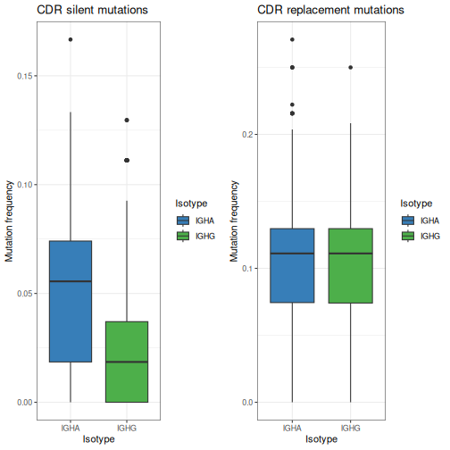

Mutation analysis
====================


Basic mutational load calculations are provided by the `observedMutations` function. 
`observedMutations` provides multiple options to control how mutations are calculated.
Mutations can be calculated as either counts or frequencies, may be divided into 
replacement (R) and silent (S) mutations, and subset into FWR and CDR specific mutations.
Additionally, alternative mutational definitions may be considered based on the 
physicochemical properties of translated codons.

## Example data

A small example Change-O database is included in the `alakazam` package. 
Analyzing mutations requires the following fields (columns) to 
be present in the Change-O database: 

* `SEQUENCE_IMGT`
* `GERMLINE_IMGT_D_MASK`


```r
# Import required packages
library(alakazam)
library(shazam)
library(dplyr)
library(ggplot2)

# Load and subset example data
data(ExampleDb, package="alakazam")
db <- subset(ExampleDb, ISOTYPE %in% c("IgA", "IgG") & SAMPLE == "+7d")
```

## Calculate the counts and frequencies of mutations over the entire sequence

When calling `observedMutations` with `regionDefinition=NULL`, the entire input sequence 
(`sequenceColumn`) is compared to the germline sequence (`germlineColumn`) to identify R and S mutations. 
If `frequency=TRUE`, the number of mutations is expressed as the frequency of mutations 
over the total number of positions that are non-N in both the input and the germline sequences. 

In the example below, the counts (`frequency=FALSE` ) and frequencies (`frequency=TRUE`) of 
R and S mutations are calculated separately. New columns containing mutation counts are 
appended to the input data.frame with names in the form `OBSERVED_<Region>_<R/S>`. 
Mutation frequencies appear in new columns named `MU_FREQ_<Region>_<R/S>`.


```r
# Calculate R and S mutation counts
db_obs <- observedMutations(db, sequenceColumn="SEQUENCE_IMGT",
                            germlineColumn="GERMLINE_IMGT_D_MASK",
                            regionDefinition=NULL,
                            frequency=FALSE, 
                            nproc=1)
# Show new mutation count columns
db_obs %>% 
    select(SEQUENCE_ID, starts_with("OBSERVED_")) %>%
    head(n=4)
```

```
##      SEQUENCE_ID OBSERVED_SEQ_R OBSERVED_SEQ_S
## 1 GN5SHBT07FUXY8              0              0
## 2 GN5SHBT05JMPI5              8              2
## 3 GN5SHBT08H4LPP              8              2
## 4 GN5SHBT05JGND3              0              0
```

```r
# Calculate R and S mutation frequencies
db_obs <- observedMutations(db_obs, sequenceColumn="SEQUENCE_IMGT",
                            germlineColumn="GERMLINE_IMGT_D_MASK",
                            regionDefinition=NULL,
                            frequency=TRUE, 
                            nproc=1)
# Show new mutation frequency columns
db_obs %>% 
    select(SEQUENCE_ID, starts_with("MU_")) %>%
    head(n=4)
```

```
##      SEQUENCE_ID MU_FREQ_SEQ_R MU_FREQ_SEQ_S
## 1 GN5SHBT07FUXY8    0.00000000   0.000000000
## 2 GN5SHBT05JMPI5    0.02359882   0.005899705
## 3 GN5SHBT08H4LPP    0.02352941   0.005882353
## 4 GN5SHBT05JGND3    0.00000000   0.000000000
```

Specifying the `combine=TRUE` argument will aggregate all mutation 
columns into a single value.


```r
# Calculate combined R and S mutation frequencies
db_obs <- observedMutations(db, sequenceColumn="SEQUENCE_IMGT",
                            germlineColumn="GERMLINE_IMGT_D_MASK",
                            regionDefinition=NULL,
                            frequency=TRUE, 
                            combine=TRUE,
                            nproc=1)
# Show new mutation frequency columns
db_obs %>% 
    select(SEQUENCE_ID, starts_with("MU_")) %>%
    head(n=4)
```

```
##      SEQUENCE_ID    MU_FREQ
## 1 GN5SHBT07FUXY8 0.00000000
## 2 GN5SHBT05JMPI5 0.02949853
## 3 GN5SHBT08H4LPP 0.02941176
## 4 GN5SHBT05JGND3 0.00000000
```

We can plot the mutation frequencies a explore differences between samples or isotypes.


```r
g1 <- ggplot(db_obs, aes(x=ISOTYPE, y=MU_FREQ, fill=ISOTYPE)) +
    theme_bw() + ggtitle("Total mutations") +
    xlab("Isotype") + ylab("Mutation frequency") +
    scale_fill_manual(name="Isotype", values=IG_COLORS) +
    geom_boxplot()
plot(g1)
```


## Calculate mutations within subregions of the V-segment

To restrict the mutational analysis to a particular area in the sequence, the `regionDefinition`
argument needs to be assigned a `RegionDefinition` object, which simply defines the subregion 
boundaries of the Ig sequence. For convenience, `shazam` provides a set of such objects. 

In the following example, we will explore the mutation frequency in the V-segment. 
The `IMGT_V` `RegionDefinition` defines the limits of the CDR and FWR in the V-segment, 
excluding the CDR3, according to the IMGT unique numbering scheme.


```r
# Calculate R and S mutation counts for individual CDRs and FWRs
db_obs_v <- observedMutations(db, sequenceColumn="SEQUENCE_IMGT",
                              germlineColumn="GERMLINE_IMGT_D_MASK",
                              regionDefinition=IMGT_V_BY_REGIONS,
                              frequency=FALSE, 
                              nproc=1)
# Show new FWR mutation columns
db_obs_v %>% 
    select(SEQUENCE_ID, starts_with("OBSERVED_FWR")) %>%
    head(n=4)
```

```
##      SEQUENCE_ID OBSERVED_FWR1_R OBSERVED_FWR1_S OBSERVED_FWR2_R
## 1 GN5SHBT07FUXY8               0               0               0
## 2 GN5SHBT05JMPI5               1               0               0
## 3 GN5SHBT08H4LPP               1               0               0
## 4 GN5SHBT05JGND3               0               0               0
##   OBSERVED_FWR2_S OBSERVED_FWR3_R OBSERVED_FWR3_S
## 1               0               0               0
## 2               0               5               1
## 3               0               5               1
## 4               0               0               0
```

```r
# Calculate aggregate CDR and FWR V-segment R and S mutation frequencies
db_obs_v <- observedMutations(db_obs_v, sequenceColumn="SEQUENCE_IMGT",
                              germlineColumn="GERMLINE_IMGT_D_MASK",
                              regionDefinition=IMGT_V,
                              frequency=TRUE, 
                              nproc=1)
# Show new CDR and FWR mutation frequency columns
db_obs_v %>% 
    select(SEQUENCE_ID, starts_with("MU_")) %>%
    head(n=4)
```

```
##      SEQUENCE_ID MU_FREQ_CDR_R MU_FREQ_CDR_S MU_FREQ_FWR_R MU_FREQ_FWR_S
## 1 GN5SHBT07FUXY8             0             0     0.0000000   0.000000000
## 2 GN5SHBT05JMPI5             0             0     0.0251046   0.004184100
## 3 GN5SHBT08H4LPP             0             0     0.0250000   0.004166667
## 4 GN5SHBT05JGND3             0             0     0.0000000   0.000000000
```

Plot a comparison between CDR silent and replacement mutations.


```r
g2 <- ggplot(db_obs_v, aes(x=ISOTYPE, y=MU_FREQ_CDR_S, fill=ISOTYPE)) +
    theme_bw() + ggtitle("CDR silent mutations") +
    xlab("Isotype") + ylab("Mutation frequency") +
    scale_fill_manual(name="Isotype", values=IG_COLORS) +
    geom_boxplot()
g3 <- ggplot(db_obs_v, aes(x=ISOTYPE, y=MU_FREQ_CDR_R, fill=ISOTYPE)) +
    theme_bw() + ggtitle("CDR replacement mutations") +
    xlab("Isotype") + ylab("Mutation frequency") +
    scale_fill_manual(name="Isotype", values=IG_COLORS) +
    geom_boxplot()
alakazam::gridPlot(g2, g3, ncol=2)
```




## Use amino acid physicochemical properties to define mutations

By default, replacement and silent are determined by exact amino acid identity. But this can be 
changed by setting the `mutationDefinition` argument. For convenience, `shazam` provides a set 
of `MutationDefinition` objects defining changes in amino acid charge, hydrophobicity, polarity 
and volume.

In the following example, replacement mutation are defined as amino acid changes that lead to a 
change in charge (`mutationDefinition=CHARGE_MUTATIONS`). Mutations that do not alter
the charge classification of a translated codon will be considered silent mutations.


```r
# Calculate charge mutation frequency for the full sequence
db_obs_ch <- observedMutations(db, sequenceColumn="SEQUENCE_IMGT",
                               germlineColumn="GERMLINE_IMGT_D_MASK",
                               regionDefinition=NULL,
                               mutationDefinition=CHARGE_MUTATIONS,
                               frequency=TRUE, 
                               nproc=1)
# Show new charge mutation frequency columns
db_obs_ch %>% 
    select(SEQUENCE_ID, starts_with("MU_")) %>%
    head(n=4)
```

```
##      SEQUENCE_ID MU_FREQ_SEQ_R MU_FREQ_SEQ_S
## 1 GN5SHBT07FUXY8   0.000000000    0.00000000
## 2 GN5SHBT05JMPI5   0.002949853    0.02654867
## 3 GN5SHBT08H4LPP   0.002941176    0.02647059
## 4 GN5SHBT05JGND3   0.000000000    0.00000000
```

We can make a plot to visualize if mutations that change the sequence charge are more 
frequent in one isotype.


```r
g4 <- ggplot(db_obs_ch, aes(x=ISOTYPE, y=MU_FREQ_SEQ_R, fill=ISOTYPE)) +
    theme_bw() + ggtitle("Charge replacement mutations") +
    xlab("Isotype") + ylab("Mutation frequency") +
    scale_fill_manual(name="Isotype", values=IG_COLORS) +
    geom_boxplot()
plot(g4)
```


