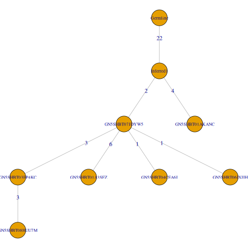

# Simulating sequence mutations

`SHazaM` provides two functions for simulating mutated sequences, one at the sequence
level (`shmulateSeq`), and the other at the lineage level (`shmulateTree`). 

Both functions rely on a 5-mer targeting model for computing the probabilities of mutations at each position along the input sequence. The 5-mer targeting models currently availbale in `SHazaM` are:

* `HH_S5F`: Human Heavy chain, Silent, 5-mer, Functional targeting model
* `HKL_S5F`: Human Kappa and Lambda light chain, Silent, 5-mer, Functional targeting model
* `MK_RS5NF`: Mouse Kappa light chain, Replacement and Silent, 5-mer, Non-Functional targeting model
* `U5N`: Uniform 5-mer Null targeting model

## Simulate mutations in a single sequence

`shmulateSeq` generates random mutations in an input sequence. This sequence is provided by the user as a string, with the acceptable alphabet being `{A, T, G, C, N, .}`. Note that `-` is not accepted as part of the input sequence. If the input sequence has a non-triplet overhang at the end, it will be trimmed to the last codon. For example, `ATGCATGC` will be trimmed to `ATGCAT` before mutations are introduced.

The total number of mutations to be introduced is user-specified. Mutations are not introduced to positions in the input sequence that contain `.` or `N`. 

Mutations are introduced iteratively using a targeting model. Targeting probabilities at each position are updated after each iteration. 


```r
library(shazam)

# Input sequence
sequence <- "NGATCTGACGACACGGCCGTGTATTACTGTGCGAGAGATA.TTTA"

# Simulate introduction of 6 mutations using the default HH_S5F targeting model
shmulateSeq(sequence, numMutations=6)
```

```
## [1] "NGATCTGACGACAGGGCCCTGTATCCCTGTGCGAGACATA.TTTC"
```

```r
# Simulate introduction of 4 mutations using the MK_RS5NF targeting model
shmulateSeq(sequence, numMutations=4, targetingModel=MK_RS5NF)
```

```
## [1] "NACTCTGACGACACGGCCGTATTTTACTGTGCGAGAGATA.TTTA"
```

## Simulate mutations in a lineage tree

`shmulateTree` generates a set of simulated sequences based on an input sequence and a lineage tree. The input sequence will act as the most recent common ancestor (MRCA) of the lineage tree, and sequences in the offspring nodes will be simulated with the numbers of mutations corresponding to the edge weights of the tree.

The lineage tree is supplied by the user as an `igraph` object, such as that returned by `buildPhylipLineage` of the `alakazam` package. For details, see the `Reconstruction of Ig lineage trees` vignette of `alakazam`. It is assumed that the `name` vertex attribute of the root node is `Germline`, as is the case with the trees built by `buildPhylipLineage`. 


```r
library(alakazam)
library(shazam)
library(igraph)

# Load example lineage
data(ExampleTrees, package="alakazam")
graph <- ExampleTrees[[17]]

# Input sequence to be used as MRCA of the lineage tree
sequence <- "NGATCTGACGACACGGCCGTGTATTACTGTGCGAGAGATAGTTTA"

# Simulate using the default HH_S5F targeting model
shmulateTree(sequence, graph)
```

```
##             NAME                                      SEQUENCE DISTANCE
## 1      Inferred1 NGATCTGACGACACGGCCGTGTATTACTGTGCGAGAGATAGTTTA        0
## 2 GN5SHBT07JDYW5 NGATCTGACGACACGGCCGTCTACTACTGTGCGAGAGATAGTTTA        2
## 3 GN5SHBT03EP4KC NGATCTGACGACACGGCGGTCCACTACTGTGCGAGAGATACTTTA        3
## 4 GN5SHBT01AKANC NGATCTGACGACGCGGCCTTGTATGACTGTGCGGGAGATAGTTTA        4
## 5 GN5SHBT01A3SFZ NCATCTGACGCAACGGCCGTCTACTACTGTGCGCGGGATAGTTCA        6
## 6 GN5SHBT08HUU7M NGATCTGACGACACGGCGGCCCACTACTGTACGAGAGACACTTTA        3
## 7 GN5SHBT04CEA6I NGATCTGACGACACGGCCGTGTACTACTGTGCGAGAGATAGTTTA        1
## 8 GN5SHBT06IXJIH NGATCTGACGACACGGCCGTCTACTACTGTGCGAGGGATAGTTTA        1
```

It is possible to exclude certain specified nodes from being considered as the MRCA and from being included as part of the simulation. To specify such nodes, use the `field` argument to indicate which annotation field in `vertex_attr(graph)` contains information relevant to deciding which nodes to exclude, and the `exclude` argument to indicate the value in the annotation field that nodes to be excluded carry. 

Note that when excluding some nodes, additional nodes that have not been explicitly specified by the user to be excluded may also get excluded. For example, suppose that node B is an offspring of node A; and node A has been specified by the user to be excluded. As a corollary of node A being excluded, its offspring node B will also become excluded, despite not being specified explicitly.


```r
# The annotation field called "SAMPLE"
vertex_attr(graph)$SAMPLE
```

```
## [1] NA    "+7d" "+7d" NA    "+7d" "+7d" "+7d" "+7d" "+7d"
```

```r
# notice that node "GN5SHBT01AKANC" is an offspring of "Inferred1"
par(mar=c(0, 0, 0, 0) + 0.1)
plot(graph, layout=layout_as_tree, edge.arrow.mode=0, vertex.label.cex=0.75)
```


```r
# Exclude nodes without a sample identifier
# The nodes "Germline" and "Inferred1" are thus excluded
# As a corollary, "GN5SHBT01AKANC", the offspring of "Inferred1", is also excluded
# In this case, "GN5SHBT07JDYW5" is then taken to be the MRCA
shmulateTree(sequence, graph, field="SAMPLE", exclude=NA)
```

```
##             NAME                                      SEQUENCE DISTANCE
## 1 GN5SHBT07JDYW5 NGATCTGACGACACGGCCGTGTATTACTGTGCGAGAGATAGTTTA        0
## 2 GN5SHBT03EP4KC NGATCTGACGACACGGCCGTGTATTACTGTACGAGAGATGCTTTA        3
## 3 GN5SHBT01A3SFZ NAGTCTGACGACACGGGCGTGCATGACTGTGCGAGAGATACTTTA        6
## 4 GN5SHBT08HUU7M NGATCTGACGACACGGCCGTGTCTTATTGTACGAGAGATGCTTCA        3
## 5 GN5SHBT04CEA6I NGATCTGACGACACGGCCGTGTATTACTGTACGAGAGATAGTTTA        1
## 6 GN5SHBT06IXJIH NGATCTGACGACACGGCCGTGTATTACTGTGCGAGAAATAGTTTA        1
```

It is also possible to add a proportional number of mutations to the immediate offsprings of the MRCA based on the fraction of the nucleotide sequence that is within the junction region. This is achieved via the optional `junctionWeight` argument, to be supplied as a numeric value between `0` and `1`. 

As an exmample, suppose that the MRCA has two immediate offsprings, each containing 2 and 4 mutations respectively compared to the MRCA. With `junctionWeight=0.2`, the number of mutations to be introduced to these two offsprings will become `round(2*(1+0.2))` (2) and `round(4*(1+0.2))` (5) respectively.


```r
# The "Inferred1" node is taken to be the MRCA and has 2 immediate offsprings
par(mar=c(0, 0, 0, 0) + 0.1)
plot(graph, layout=layout_as_tree, edge.arrow.mode=0, vertex.label.cex=0.75)
```



```r
# Add 20% mutation rate to the immediate offsprings of the MRCA
shmulateTree(sequence, graph, junctionWeight=0.2)
```

```
##             NAME                                      SEQUENCE DISTANCE
## 1      Inferred1 NGATCTGACGACACGGCCGTGTATTACTGTGCGAGAGATAGTTTA        0
## 2 GN5SHBT07JDYW5 NGATCTGACGACACGGCCGTGTCTTACTGTGCGAGAGATAGTTTC        2
## 3 GN5SHBT03EP4KC NGATCTGACGACACGGCCGTGTCTTACTATGCGACAGATAGTTTA        3
## 4 GN5SHBT01AKANC NGATCTGACGAAACGGCCGTGTGTCACTGTGCGAGAGAGAGTGTA        5
## 5 GN5SHBT01A3SFZ NGGTTTGACGACACGCCCGTGTCTGACTATACGAGAGATAGTTTC        6
## 6 GN5SHBT08HUU7M NGATCTGACGCCACGGCCGTGTCTTGCTATGCGACAGGTAGTTTA        3
## 7 GN5SHBT04CEA6I NGATGTGACGACACGGCCGTGTCTTACTGTGCGAGAGATAGTTTC        1
## 8 GN5SHBT06IXJIH NGATCTGACGACACGGCCGTGTCTTACTGTGCGGGAGATAGTTTC        1
```
