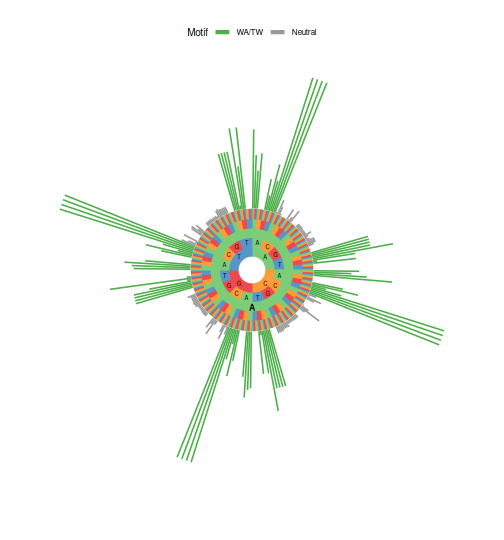
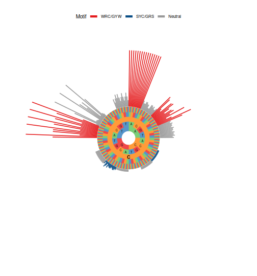
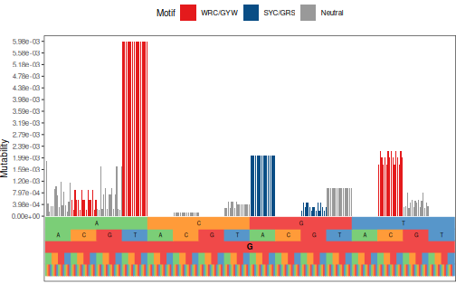
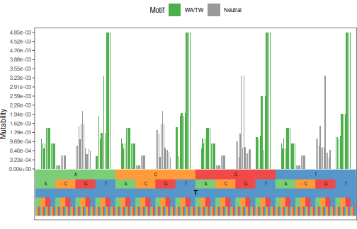

# SHM targeting models

The targeting model is the background likelihood of a particular mutation, based 
on the surrounding sequence context as well as the mutation itself. The model is 
inferred from observed mutations in the data. The model can then be transformed 
into a distance function to compare Ig sequences of a given dataset based on the 
likelihood of the observed mutations. This is done via the following steps:

1. Infer a substitution model, which is the likelihood of a base mutating to 
   each other base given the microsequence context. 
2. Infer a mutability model, which is likelihood of a given base being mutated
   given the microsequence context and substitution model.
3. Visualize the mutability model to identify hot and cold spots.
4. Calculate a nucleotide distance matrix based on the underlying SHM models.

## Example data

A small example AIRR Rearrangement database is included in the `alakazam` package. 
Inferring a targeting model requires the following fields (columns) to 
be present in the table: 

* `sequence_id`
* `sequence_alignment`
* `germline_alignment_d_mask`
* `v_call`


``` r
# Import required packages
library(shazam)

# Load example data
data(ExampleDb, package="alakazam")

# Subset to IGHG for faster usage demonstration
db <- subset(ExampleDb, c_call == "IGHG")
```

## Infer targeting model (substitution and mutability)

The function for inferring substitution rates (`createSubstitutionMatrix`) 
counts the number of mutations from a given base to all others occurring in the 
center position for all 5-mer motifs in the dataset. The `model` argument of 
`createSubstitutionMatrix` allows the user to specify whether to count all 
mutations, or just silent mutations to infer the model. Column names for the 
sample sequence, germline sequence, and V call can also be passed in as 
parameters if they differ from Change-O defaults. Additionally, the 
`multipleMutation` parameter determines handling of multiple mutations in a 
single 5-mer: `independent` treats each mutation independently and `ignore` 
entirely disregards 5-mers with multiple mutations.


``` r
# Create substitution model using silent mutations
sub_model <- createSubstitutionMatrix(db, model="s", 
                                      sequenceColumn="sequence_alignment",
                                      germlineColumn="germline_alignment_d_mask",
                                      vCallColumn="v_call")
```

The function for inferring a mutability model (`createMutabilityMatrix`) counts 
the number of mutations in all 5-mer motifs of the dataset, and depends upon the
inferred substitution rates. Similar parameters as those available for 
inferring the substitution rates are available to adjust this function.


``` r
# Create mutability model using silent mutations
mut_model <- createMutabilityMatrix(db, sub_model, model="s",
                                    sequenceColumn="sequence_alignment",
                                    germlineColumn="germline_alignment_d_mask",
                                    vCallColumn="v_call")
```

`createMutabilityMatrix` creates an object of class `MutabilityModel` that contains 
a named numeric vector of 1024 normalized mutability. The numbers of silent and 
replacement mutations used for estimating the 5-mer mutabilities are recorded in 
the `numMutS` and `numMutR` slots, respectively. rates. The `source` slot contains
a named vector indicating whether each 5-mer mutability was inferred or measured.
A data.frame with both the mutability values and derivation source.


``` r
# Number of silent mutations used for estimating 5-mer mutabilities
mut_model@numMutS
# Number of replacement mutations used for estimating 5-mer mutabilities
mut_model@numMutR
# Mutability and source as a data.frame
head(as.data.frame(mut_model))
```

The inferred substitution and mutability models returned by the above functions
only account for unambiguous 5-mers. However, there may be cases in which the 
user may need the likelihood of a mutation in a 5-mer with ambiguous characters. 
Each of the above functions has a corresponding function (`extendSubstitutionMatrix` 
and `extendMutabilityMatrix`) to extend the models to infer 5-mers with Ns by 
averaging over all corresponding unambiguous 5-mers.


``` r
# Extend models to include ambiguous 5-mers
sub_model <- extendSubstitutionMatrix(sub_model)
mut_model <- extendMutabilityMatrix(mut_model)
```

These extended substitution and mutability models can be used to create an 
overall SHM targeting matrix (`createTargetingMatrix`), which is the combined 
probability of mutability and substitution. 


``` r
# Create targeting model matrix from substitution and mutability models
tar_matrix <- createTargetingMatrix(sub_model, mut_model)
```

All of the above steps can be combined by using the single function 
`createTargetingModel` to infer a `TargetingModel` object directly from 
the dataset. Again, the numbers of silent and replacement mutations used 
for estimating the 5-mer mutabilities are also recorded in the `numMutS` and 
`numMutR` slots respectively.

Additionally, it is generally appropriate to consider the mutations
within a clone only once. Consensus sequences for each clone can be generated
using the `collapseClones` function.


``` r
# Collapse sequences into clonal consensus
clone_db <- collapseClones(db, cloneColumn="clone_id", 
                           sequenceColumn="sequence_alignment",
                           germlineColumn="germline_alignment_d_mask",
                           nproc=1)
# Create targeting model in one step using only silent mutations
# Use consensus sequence input and germline columns
model <- createTargetingModel(clone_db, model="s", sequenceColumn="clonal_sequence", 
                              germlineColumn="clonal_germline", vCallColumn="v_call")
```

## Visualize targeting model

The visualization of a dataset's underlying SHM mutability model can be used to 
investigate hot and cold spot motifs. The length of the bars on the plot of 
mutability rates corresponds to the likelihood of a given base in the given 
5-mer being mutated. The plotting function `plotMutability` has an argument 
`style` to specify either a hedgehog plot (circular) or barplot display of
5-mer mutability rates. If the mutability for only specific bases is required, 
this can be specified via the `nucleotides` argument.


``` r
# Generate hedgehog plot of mutability model
plotMutability(model, nucleotides="A", style="hedgehog")
```



``` r
plotMutability(model, nucleotides="C", style="hedgehog")
```




``` r
# Generate bar plot of mutability model
plotMutability(model, nucleotides="G", style="bar")
```



``` r
plotMutability(model, nucleotides="T", style="bar")
```



## Calculate targeting distance matrix

In the Change-O pipeline, the `hs5f` cloning method rely on an inferred 
targeting model. If users wish to use a targeting model inferred from their 
data to assign distance between sequences for clonal grouping, then the observed 
SHM targeting rates must be transformed into distances. The 
`calcTargetingDistance` function returns a matrix of distances between each 5-mer 
and each corresponding mutation of the center base. This matrix can also be 
generated and written directly to a file using the function 
`writeTargetingDistance`.


``` r
# Calculate distance matrix
dist <- calcTargetingDistance(model)
```
